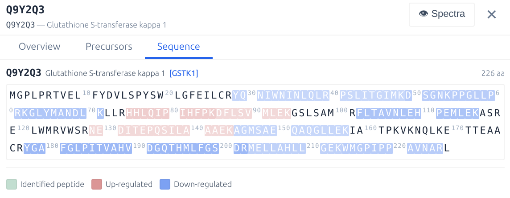
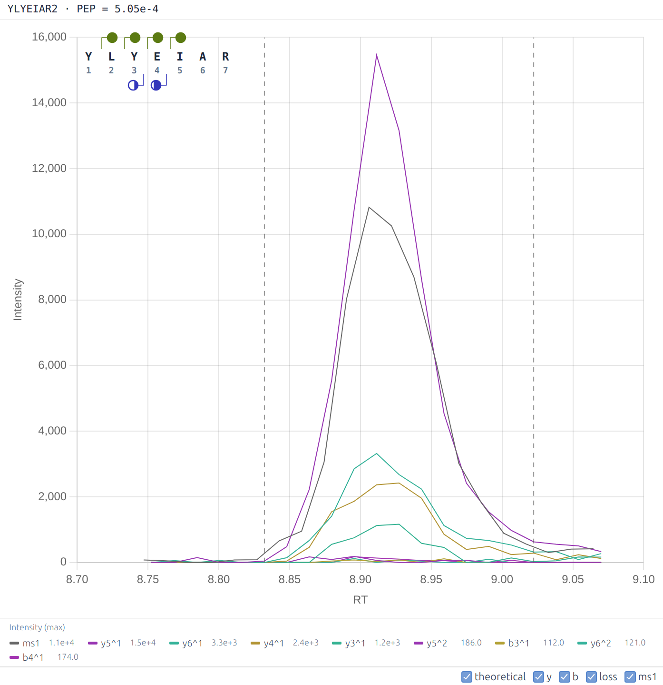

<p align="center" style="margin-bottom: 0px !important;">
  
</p>
<h1 align="center" style="margin-top: -0px; font-size: 20px">DIA-NN</h1>

DIA-NN is an automated software suite for data-independent acquisition (DIA) proteomics data processing.

DIA-NN is built on the following principles:    
- **Reliability** achieved via stringent statistical control
- **Robustness** achieved via flexible modelling of the data and automatic parameter selection
- **Reproducibility** promoted by thorough recording of all analysis steps
- **Ease of use**: high degree of automation, an analysis can be set up in several mouse clicks, no bioinformatics expertise required
- **Powerful tuning options** to enable unconventional experiments
- **Scalability and speed**: up to 1000 mass spec runs processed per hour

**DIA-NN 2.6.1 Enterprise** (full functionality, for both Industry and Academia): contact Aptila Biotech [aptila.bio](https://www.aptila.bio) or [Speak with a Solutions Specialist | Thermo Fisher Scientific](https://www.thermofisher.com/uk/en/home/global/forms/industrial/contact-solutions-specialist.html?erpType=Global_E1) to purchase or obtain a trial license. 

**Download DIA-NN 2.6.1 Academia** (limited functionality, for non-profit academic research): https://github.com/vdemichev/DiaNN/releases/tag/2.0.  

### Table of Contents
**[Installation](#installation)**<br>
**[Getting started with DIA-NN](#getting-started-with-dia-nn)**<br>
**[Changing default settings](#changing-default-settings)**<br>
**[Raw data formats](#raw-data-formats)**<br>
**[Spectral library formats](#spectral-library-formats)**<br>
**[Sequence databases](#sequence-databases)**<br>
**[Output](#output)**<br>
**[Command interface](#command-interface)**<br>
**[Analysis and visualisation](#analysis-and-visualisation)**<br>
**[Automated pipelines](#automated-pipelines)**<br>
**[PTMs and peptidoforms](#ptms-and-peptidoforms)**<br>
**[Fine tuning prediction models](#fine-tuning-prediction-models)**<br>
**[Multiplexing using plexDIA](#multiplexing-using-plexdia)**<br>
**[Editing spectral libraries](#editing-spectral-libraries)**<br>
**[Custom decoys](#custom-decoys)**<br>
**[Integration with other tools](#integration-with-other-tools)**<br>
**[Quantification](#quantification)**<br>
**[Speed optimisation](#speed-optimisation)**<br>
**[Incremental processing](#incremental-processing)**<br>
**[InfinDIA](#infindia)**<br>
**[DDA](#dda)**<br>
**[Basics of DIA data analysis](#basics-of-dia-data-analysis)**<br>
**[GUI settings reference](#gui-settings-reference)**<br>
**[Command-line reference](#command-line-reference)**<br>
**[Main output reference](#main-output-reference)**<br>
**[Frequently asked questions](#frequently-asked-questions)**<br>
**[Troubleshooting](#troubleshooting)**<br>
**[Key publications](#key-publications)**<br>

### Installation

On **Windows**, download and run the .msi file. It is recommended to install DIA-NN into the default folder suggested by the installer. If the Visual C++ runtime or .NET SDK are not already installed on the system, download and install [vc_redist.x64.exe](https://aka.ms/vs/17/release/vc_redist.x64.exe) and the [.NET SDK 8.0.407 installer](https://dotnet.microsoft.com/en-us/download/dotnet/thank-you/sdk-8.0.407-windows-x64-installer), then reboot the PC.  

On **Linux**, download and unpack the Linux .zip file. The Linux version of DIA-NN is built on Linux Mint 21.2, and the target system must provide glibc and other standard C/C++ libraries at versions equal to or newer than those on Linux Mint 21.2, plus .NET SDK 8.0-series (version 8.0.407 or later). Container images (Docker or Apptainer/Singularity) include all dependencies, removing any host-library requirements. To build a container, we recommend starting with the latest Debian Docker image; the included script make_docker.sh automates this process.

It is also possible to run DIA-NN on Linux using **Wine** 6.8 or later.  

### Getting Started with DIA-NN

<div style="text-align:center">
  
</div>

If you are new to DIA proteomics, please take a look at the [Basics of DIA data analysis](#basics-of-dia-data-analysis).  

A typical DIA-NN workflow has two stages: *library preparation* and *data analysis*. First, use DIA-NN to generate a **predicted spectral library** from the sequence database; this library can then be reused for all experiments involving the same organism. This first step is not necessary if one already has a suitable **empirical spectral library** (e.g. one generated by DIA-NN from a previous DIA experiment). Second, have DIA-NN analyse the raw data with the selected spectral library. Each step requires only a few mouse clicks.

**Tip**: DIA-NN includes a **Wizard** (accessible from the **Pipeline** panel toolbar) that guides step-by-step through setting up common analysis workflows, such as generating a predicted library, analysing raw data, creating empirical or calibration libraries, fine-tuning prediction models, or plexDIA analysis. The Wizard presents guided steps with context-appropriate defaults and recommendations, then automatically configures the settings. The Wizard effectively serves as a collection of interactive tutorials.  

**Predicted library generation**:  
1. Click **Add FASTA**, add one or more sequence databases in UniProt format. 
2. In the **Precursor ion generation** panel, set **Mode** to **Prediction from FASTA**.  
3. (Optional) One can edit the **Output library** field. This field serves as a name template. In workflows that generate empirical DIA-based libraries, these are saved in Apache .parquet format as specified by **Output library**. For predicted library generation, however, the output file takes the `.predicted.speclib` extension (DIA-NN's own compact binary format for spectral libraries), with the name derived from the same template. 
4. Click **Run**. DIA-NN's log will be displayed in the **Log** panel. Library generation typically completes in under 2 minutes per million precursors on a modern 16-core desktop CPU.  

**Analysing with (any) spectral library**:  
1. Click **Spectral library** and specify the library to use. This can be the .predicted.speclib file generated above, a .parquet library from a previous DIA-NN analysis, or a third-party predicted or empirical library in a compatible format (see below). Set **Mode** to **Library search / Off**.  
2. Click **Add FASTA**, add one or more sequence databases in UniProt format, corresponding to the spectral library (i.e. if the library contains human proteins, any human database is appropriate). If the library does not contain correct protein information (e.g. a third-party library), enable **Reannotate** to update the protein information for each precursor in the library.    
3. In the **Input** panel, click the **+** button next to **Raw data files** and select the raw data files (use **Add .d** for Bruker timsTOF .d folders).  
4. In the **Output** panel, adjust **Main output**. This is the name of the main output report generated by DIA-NN. It is also used by DIA-NN as the name template for any other report files it is going to generate (more about these below).  
5. Click **Run**. Note that DIA-NN will use the raw data to generate an empirical spectral library (file name specified by **Output library**).  

If this is your first time running DIA-NN, we recommend reviewing the output on a small dataset that can be analysed in a couple of minutes. For this, download the raw data files (dia-PASEF 10ng.zip archive), empirical spectral library (K562-spin-column-lib.zip) and a FASTA database (human_canonical_uniprotkb_proteome_UP000005640_2023_12_16.fasta) from the [Slice-PASEF benchmarks repository](https://osf.io/t2ymc/?view_only=7462fffb20e648fc83afc75d8c67e9f8). When analysing this dataset, uncheck **MBR** (in the **Algorithm** panel) and **Output library** (in the **Output** panel).   

**Output**:
- The DIA-NN main report contains a list of all precursors ('Precursor.Id' column), with matched proteins ('Protein.Group' column) and quantities for both precursors and proteins ('Precursor.Normalised' and 'PG.MaxLFQ', respectively), for each run in the experiment. The report is in .parquet format &ndash; a compact compressed tabular format that can be accessed with the R `arrow` or Python `polars` packages in automated fashion. One can also view the report and perform visualisation and statistical analysis (such as PCA, DA testing or GSEA) using the **Analyse** mode of the GUI. 

- To quickly inspect protein quantities using software such as MS Excel, DIA-NN generates ready-to-use .pg_matrix.tsv and .unique_genes_matrix.tsv tab-separated tables. DIA-NN's **Analyse** mode also allows to filter the main report and export quantitative matrices. 

### Changing default settings

**LC-MS-specific parameters**. For publication-ready/production-ready analyses, it is preferable to adjust the mass accuracies and the scan window used by DIA-NN. These parameters inform DIA-NN of the expected magnitude of mass deviations (mass accuracies) and the expected number of DIA cycles per average peptide elution time. By default, these are set to 0, meaning that DIA-NN will optimise them automatically for the first run in the experiment and then reuse the optimised settings for other runs. This optimisation is inherently noisy: even replicate injections may not produce identical results, and therefore the analysis results will depend on which run is first in the list. It is preferable to fix these three parameters to values known to be optimal for a particular LC-MS setup:

1. If the data were generated on timsTOF, set both **MS1 accuracy** (MS1 mass tolerance) and **MS2 accuracy** (MS/MS mass tolerance) to 15 (ppm). Note that these settings provide a 'guidance' to DIA-NN, the actual m/z window used to match theoretical m/z values to the (m/z, intensity) pairs in the raw data file will be specific to both the precursor and the raw data in the vicinity of its putative retention time.  

2. If the data were generated on Orbitrap Astral, set **MS1 accuracy** to 4 and **MS2 accuracy** to 10. The MS1 accuracy setting here assumes 240k Orbitrap resolution, which is the optimal choice for the majority of experiments on Astral. 

3. If the data were generated on TripleTOF 6600 or ZenoTOF, set both **MS1 accuracy** and **MS2 accuracy** to 20. 

4. For Orbitrap instruments, the following table provides a good starting point for setting the mass accuracies:

| Orbitrap resolution | Accuracy (ppm) |
|------------|--------------|
| 240k | 4 |
| 120k | 7 |
| 60k | 10 |
| 30k | 15 |

5. Set **Scan window** to the approximate number of DIA cycles during the elution time of an average peptide. 

6. One can also optimise all parameters to achieve the best possible performance from the data. For this, run DIA-NN on several representative runs (best to use any suitable empirical library, as this is the quickest) with **Unrelated runs** option checked and review the 'Averaged recommended settings for this experiment' values reported at the end of the log. 

7. (Enterprise edition) When analysing human samples, enable **Knowledge base** (**Algorithm** panel). 

**How to interpret the rest of this guide**. The preceding guidance covers the vast majority of standard DIA-NN workflows. However, DIA-NN also offers powerful tuning options for specialised or unconventional experiments. When starting with DIA-NN, we recommend first running it on a few representative datasets to become familiar with its operation, and then reviewing the rest of this guide to determine whether any of the recommendations apply to the applications of interest. The rest of this guide provides detailed recommendations for specialised workflows. 

In general, we recommend the following: 
- Only change the default settings if (i) the change is recommended in the present guide, or (ii) there is a clear rationale for the change given a specific type of experiment not covered in this guide, or (iii) the goal is to investigate the performance of alternative settings compared to the default settings that have been tested already.

- Examine DIA-NN's log for warnings/errors. The warnings and errors are printed when they occur as well as at the end of the log, i.e. one can immediately see them once the DIA-NN analysis finishes. They are also displayed by the **QC Dashboard** in **Analyse** mode.   

- DIA-NN prints some comments on the settings used at the top of the log, it is best to examine these the first time particular settings are used, to see if there are any recommendations.  

### Raw data formats

DIA-NN supports the following raw data formats: Thermo .raw, Bruker .d, Sciex .wiff, .mzML and .dia (DIA-NN's own format for storing spectra). Conversion from any supported format to .dia is possible (except for Slice/diagonal acquisitions on timsTOFs). When running on Linux (native builds, not Wine), only .d, .raw, .mzML and .dia data are supported.  

For .wiff support, download and install [ProteoWizard](http://proteowizard.sourceforge.net/download.html) &ndash; choose the 64-bit version that supports vendor files. Then copy all .dll files whose names contain 'Clearcore' or 'Sciex' from the ProteoWizard folder to the DIA-NN installation folder (the one containing diann.exe, DIA-NN.exe and auxiliary DIA-NN files).  

.mzML files should be centroided and contain data as spectra (e.g. SWATH/DIA) and not chromatograms.  

<details>
  <summary>Technology support</summary>

- DIA and SWATH are supported 
- Orbitrap Astral is supported 
- FAIMS with constant CV is supported 
- Acquisition schemes with overlapping windows are supported 
- Gas-phase fractionation is supported 
- Scanning SWATH and ZT Scan DIA are supported 
- dia-PASEF/py-diAID are supported 
- Slice-PASEF is supported 
- midia-PASEF is supported 
- Other diagonal PASEF methods are supported, however accuracy of quantification needs to be validated with benchmarks 
- multiplexing with non-isobaric tags and SILAC is supported 
- MSX-DIA is not supported 
</details>

<details>
  <summary>Conversion</summary>

Many mass spec formats, including those few that are not supported by DIA-NN directly, can be converted to .mzML using the MSConvertGUI application from [ProteoWizard](http://proteowizard.sourceforge.net/download.html). This works for all supported formats except Bruker .d and SCIEX Scanning SWATH or ZT Scan DIA &ndash; these need to be accessed by DIA-NN directly. The following MSConvert settings must be used for conversion: Binary encoding precision: 32-bit, Write index: checked, all other options in the Options panel unchecked, Peak Picking specified as the first filter, with Algorithm set to Vendor. 

</details>

### Spectral library formats

DIA-NN supports comma-separated (.csv), tab-separated (.tsv, .xls or .txt) or .parquet tables as spectral libraries, as well as .speclib (compact format used by DIA-NN). For vast majority of applications, only DIA-NN-generated spectral libraries (.parquet or .speclib) should be used. 

<details>
  <summary>In detail</summary>

Libraries in the PeakView format as well as libraries produced by FragPipe, TargetedFileConverter (part of OpenMS) are supported directly, however, compatibility should be verified for each combination of software version, settings, and raw data type.  

DIA-NN can convert any library it supports into its own .parquet format. For this, click **Spectral library** (**Input** panel), select the library to convert, select the **Output library** file name (**Output** panel), click **Run**. If there is a need to use a library in an uncommon or non-standard format, it may be helpful to convert it to DIA-NN's .parquet and then examine the resulting library (using DIA-NN's **Analyse** mode, the R `arrow` package, or the Python `polars` package) to verify that the contents appear as expected.

All .tsv/.xls/.txt/.csv/.parquet libraries are just simple tables with human-readable data, and can be explored/edited, if necessary, using DIA-NN's **Analyse** mode, Excel or R/Python. 
</details>

### Sequence databases

DIA-NN accepts sequence databases in uncompressed FASTA format. The UniProt format is fully supported. For sequence databases in other formats, DIA-NN will typically extract the correct protein sequence IDs, but may not correctly read the protein names, gene names, and protein descriptions. In such cases, we recommend using an R package such as `seqinr` or `Biostrings` to reformat the database in UniProt format.  

### Output

The **Output** panel specifies where the output should be saved as well as the file names for the main output report and (optionally) the output spectral library. DIA-NN uses these file names to derive the names of all of its output files. The following subsections describe the different types of DIA-NN output. Most workflows require only the main report (for analysis using DIA-NN's **Analyse** mode or in R or Python &ndash; recommended) or the matrices (simplified output for MS Excel). When the generation of **Matrices** is enabled, DIA-NN also produces a .manifest.txt file with a brief description of the output files generated.   

<details>
  <summary>Main report</summary>

A text table in .parquet format containing precursor and protein IDs, along with extensive associated metadata. Please use DIA-NN's **Analyse** mode or the R `arrow` or Python `polars` packages to process. These are complementary: the **Analyse** mode allows to obtain biological insights in minutes, featuring publication-quality visuals and built-in optimisations for DIA proteomics data. It is therefore highly useful for initial data analyses. R/Python, on the other hand, allow for full automation and fully customisable outputs, and are therefore recommended for generating final conclusions and visualisations. 

Most column names are self-explanatory, and the full reference as well as guidance on how to filter the main report can be found in [Main output reference](#main-output-reference). The following keywords are used when naming columns:
- **PG** means protein group
- **GG** means gene group
- **Quantity** means non-normalised quantity
- **Normalised** means normalised quantity
- **TopN** means normalised protein quantity calculated using the TopN method when the **Quantification strategy** is set to **Legacy (direct)**; using these is usually not recommended
- **MaxLFQ** means normalised protein quantity calculated using QuantUMS (**Quantification strategy** set to one of **QuantUMS** modes) or the MaxLFQ (**Quantification strategy** set to **Legacy (direct)**) algorithm, using quantities in this column is recommended for most applications
- **Global** refers to a global q-value, that is calculated for the entire experiment
- **Lib** refers to the respective global q-value saved in the spectral library; when using **MBR**, **Lib** q-values will correspond to q-values in the empirical DIA-based lib created in the first pass of **MBR**

</details>

<details>
  <summary>Matrices</summary>

These contain normalised QuantUMS or MaxLFQ quantities for protein groups ('pg_matrix'), gene groups ('gg_matrix'), unique genes ('unique_genes_matrix'; i.e. genes identified and quantified using only proteotypic, that is gene-specific, peptides) as well as normalised quantities for precursors ('pr_matrix'). They are filtered at 1% FDR, using global q-values for protein groups and both global and run-specific q-values for precursors. Additional 5% run-specific protein-level FDR filter is applied to the protein matrices, use --matrix-spec-q to adjust it. Sometimes DIA-NN will report a zero as the best estimate for a precursor or protein quantity. Such zero quantities are omitted from protein/gene matrices.  

A site-level report and site quantification matrices are also generated when variable modifications are declared and the FASTA database is provided, see [PTMs and peptidoforms](#ptms-and-peptidoforms). 
</details>

<details>
  <summary>Protein description</summary>

The .protein_description.tsv file is generated along with the Matrices and contains basic protein information known to DIA-NN (sequence IDs, names, gene names, description, sequence). 
</details>

<details>
  <summary>Stats report</summary>

Contains a number of QC metrics which can be used for data filtering, e.g. to exclude failed runs or as a readout for method optimisation. Note that the number of proteins reported here corresponds to the number of unique proteins (i.e. identified with proteotypic precursors) in a given run at 1% unique protein q-value. This number can be reproduced from the main report generated using precursor FDR threshold of 50% and filtered using Protein.Q.Value <= 0.01 & Proteotypic == 1. The definition of 'protein' in this context depends on the **Protein inference** setting.    

</details>

<details>
  <summary>PDF reports</summary>

Two PDF reports, one containing QC metrics for each acquisition, another with trends observed over the experiment. The PDF reports are generated automatically by the DIA-NN GUI, once DIA-NN completes processing the raw data and generates a report. 

</details>

<details>
  <summary>Flexible reanalysis</summary>

The **Output** panel controls how DIA-NN handles .quant files. DIA-NN processes raw data in two phases. It first performs the computationally demanding part of the processing separately for each individual run and saves the identifications and quantitative information to a separate .quant file. Once all runs are processed, it collects the information from all .quant files and performs cross-run steps, such as global q-value calculation, protein inference, calculation of final quantities, and normalisation.

This architecture enables flexible reanalysis. For example, one can stop the processing at any moment and then resume starting with the run that was stopped at. One can also remove some runs from the experiment, add extra runs, and quickly re-run the analysis without having to reprocess the runs already completed. These capabilities are enabled by the **Reuse .quant files** option. The .quant files are saved to/read from the **Temp/.dia dir** (or the same location as the raw files, if no temp folder is specified).

When using this option, it is essential to ensure that the .quant files were generated with the exact same settings as applied in the current analysis, with the exception of **FDR**, **Threads**, **Detailed log**, **MBR**, **Cross-run normalisation**, **Quantification strategy** and **Library generation** &ndash; these settings can differ. It is possible to transfer .quant files to another computer and reuse them there without transferring the original raw files. Important: it is strongly recommended to only reuse .quant files when both mass accuracies and the scan window are fixed to specific values (non-zero), otherwise DIA-NN will perform optimisation of these yet again using the first run for which a .quant file has not been found.

</details> <br> 

**Note:** the reports in .parquet format provide the full output information for any kind of downstream processing. The .tsv matrices are there to simplify the analysis when using MS Excel or similar software. The numbers of precursors and proteins reported in different types of output files might appear different due to different filtering used to generate those, please see the descriptions above. All the 'matrices' can be reproduced from the main .parquet report, if generated with precursor FDR set to 50%, using R or Python.

<details>
  <summary>Overriding protein and gene names</summary>

By default, DIA-NN reads the following protein metadata from the FASTA database: protein sequence identifier (accession; e.g. P02768), protein name (e.g. ALBU_HUMAN), gene name (e.g. ALB) and the protein description. DIA-NN supports commands that allow changing how these are treated, cf. [Command-line reference](#command-line-reference): --ids-to-names, --tag-to-ids, --species-ids and --species-genes. For example, --ids-to-names will result in Genes.MaxLFQ.Unique output column representing protein ID quantities obtained using protein ID-specific peptides. The other options can be useful for multi-species or entrapment benchmarking. 

</details> <br> 

### Command interface
DIA-NN provides a graphical user interface (GUI) that invokes an underlying command-line tool (diann.exe, diann-linux or a container). The command-line tool can also be used separately, e.g. as part of custom automated processing pipelines. Further, even when using the GUI, one can pass options/commands to the command-line tool via the **Additional options** text field. All these options start with a double dash `--` followed by the option name and, if applicable, some parameters to be set. Any option prefixed with `--` in this guide should be entered in the **Additional options** text field. Some useful options are mentioned throughout this guide, and the full reference is provided in [Command-line reference](#command-line-reference).

When the GUI launches the command-line tool, it prints in the **Log** panel the exact set of commands it used. To reproduce the behaviour observed when using the GUI (e.g. for automated analysis on a cluster), pass the same commands to the command-line tool directly.  
```
diann.exe [commands]  
```
Commands are processed in the order they are supplied, and with most commands this order can be arbitrary.

On Linux, some symbols have special meaning in the terminal, therefore, e.g. the semicolon ';' (e.g. as part of --channels), the asterisk '*' or the exclamation mark '!' (e.g. in --cut) need to be preceded by a backslash on Linux for correct behaviour.  

For convenience, as well as for handling experiments consisting of thousands of files, some of the options/commands can be stored in a config file. For this, create a text file with any extension, say, diann_config.cfg, type in any commands supported by DIA-NN in there, and then reference this file with --cfg diann_config.cfg (in the **Additional options** text field or in the command used to invoke the diann.exe/diann-linux command-line tool).

### Analysis and visualisation
DIA-NN offers several tools for analysing, visualising, and interpreting proteomics results.

**DIA-NN Analyse**. Click **Analyse** in the **Pipeline** panel toolbar to open the **Report Window**, a comprehensive post-processing, analysis, and visualisation environment for DIA-NN output. The Analyse functionality requires a DIA-NN main report (.parquet) to be present. The Report Window provides six tabs, described below.

<details>
  <summary>Experiment Design</summary>

The **Experiment Design** tab lets one assign experimental conditions and metadata to runs. This step is a prerequisite for differential expression and pathway analysis.

* **Auto-detect**: Automatically parses run file names to populate condition columns. Useful when file-naming conventions encode experimental variables.
* **Add Column**: Adds a new metadata column (of type "factor" or "characteristic") that one can fill in manually.
* **Import / Export**: Import metadata from a tab-separated table or SDRF file; paste metadata from a spreadsheet; export the current design as TSV or SDRF for use in external tools.
* **Cell editing**: Click any cell in the design table to edit its value directly. Right-click for batch operations (fill down, fill selection, clear). Column headers offer a context menu for renaming, changing the column type, sorting, splitting, merging, duplicating, or removing columns.
* **Column type classification**: Each metadata column is automatically classified as **factor** (2-12 unique values), **continuous** (>=3 unique values, all numeric), or **characteristic** (everything else &ndash; 0-1 unique values or >=13 unique values). Only factor and continuous columns appear in analysis controls (conditions, covariates, PCA colour-by, heatmap annotations, etc.); characteristic columns are display-only.
* **Undo / Redo**: All design changes can be undone and redone.
* **Validation**: A panel above the table warns about potential issues such as conditions with only a single replicate.

</details>

<details>
  <summary>QC Dashboard</summary>

The **QC Dashboard** tab displays quality-control metrics for the experiment.

* **Cross-run summary** (default view): a number of interactive chart panels, including identified protein groups and precursors per run, MS1 area and RT-deviation distributions, normalisation factor trends, retention time, ion mobility, and FWHM distributions, chromatographic profiles, and overall quantification quality.
* **Per-run diagnostics**: Select an individual run to see a number of diagnostic plots, including RT, m/z, and charge-state distributions; 2-D heatmaps of RT vs predicted RT, IM vs m/z, FWHM vs RT, normalisation factor vs RT, and mass-accuracy (ppm) vs RT and vs m/z for both MS1 and MS2.
* **Run selector**: Switch between the all-runs summary and any individual run.
* **Colour by**: Colour the summary plots by any experiment design column, making it easy to spot batch effects or condition-specific trends.
* **PDF export**: Export the current dashboard view to a multi-page PDF.
* **Info buttons**: Each plot panel includes an ⓘ button that expands a short educational description of the metric.

</details>

<details>
  <summary>Filter</summary>

The **Filter** tab provides data-level filtering controls that are applied before any analysis on the next (Interpret) tab.

* **Data Pipeline**:
  - Auto-filters are seeded on first use: `Q.Value <= 0.01` and `Global.PG.Q.Value <= 0.01` (plus channel-specific q-value filters for plexDIA data). These can be removed if needed.
  - **+ Filter**: Add custom filter expressions using column names and comparison operators (e.g. `PG.MaxLFQ > 0`).
  - **+ Column**: Add computed columns using expressions (e.g. `LOG2(PG.MaxLFQ) * 2`).
  - **Reset Pipeline**: Clears all user-added operations and re-seeds the default auto-filters.
* **Run Filter**:
  - Exclude runs by minimum/maximum precursor or protein-group count.
  - Exclude runs by metadata column values (categorical selection or numeric range).
  - Exclude runs with median empirical quantification quality below a threshold (full dataset or top-10 protein groups). 
* **Apply & Rerun**: After adjusting filters, click this button (visible once an analysis has been run) to jump back to the Interpret tab and re-execute the current analysis with the updated filters.

</details>

<details>
  <summary>Interpret</summary>

The **Interpret** tab provides statistical analysis and interactive visualisation tools. It covers differential testing, principal component and factor analysis, pathway enrichment, and protein-level inspection including sequence coverage and regulation of individual precursors.

The analysis results are exportable as both text tables and vector/raster graphics. DIA-NN automatically generates a description of all Methods used to produce the analysis. For advanced applications, the user is provided with a JavaScript sandbox with code to reproduce or modify the analysis.

The tab is divided into a **sidebar** (configuration controls) and a **main area** (results, interactive plots, tables, and methods text).

**Quantification level**. At the top of the sidebar, select the biological entity level for analysis. Available options depend on columns present in the DIA-NN report:

* **Protein Groups** (`PG.MaxLFQ`) &ndash; default; analysis at the protein group level.
* **Genes** (`Genes.MaxLFQ`) &ndash; gene-level quantities aggregated across all matching protein groups.
* **Genes &ndash; Unique** (`Genes.MaxLFQ.Unique`) &ndash; gene-level quantities using only proteotypic (gene-specific) peptides.
* **PTM Sites** &ndash; requires a `.site_report.parquet` next to the main report. When selected, a **localisation-confidence slider** (default >= 0.75) controls the minimum site-localisation probability.

When **QuantUMS quality metrics** are detected in the data, two additional thresholds appear: a **per-sample quality** filter (minimum quality metric for each entity in each run) and an **average quality** filter (minimum average quality across runs). These provide an independent layer of quantitative quality control on top of standard FDR filtering and can be used to enhance the statistical analyses.

**Analysis types**. Five analysis modes are available from the Analysis Type dropdown (Differential Abundance is selected by default):

* **Table view**. A sortable, searchable table of all quantified entities. Each row shows the entity name, supporting precursor count, number of runs in which the entity was quantified, a colour-coded detection percentage, and summary statistics: mean, median, SD (on the log2 scale), and coefficient of variation (on the linear scale). A minimum coverage filter restricts the view to entities detected in a given proportion of runs. Clicking an entity name opens the **Entity Detail** overlay (see below). The quantitative matrix (entities x runs) can be exported as TSV, optionally with extra normalisation.

* **Differential Abundance**. Identifies entities that are significantly up- or down-regulated between experimental conditions. Two comparison modes are supported:

  - *Pairwise (A vs B)*. Select a factor column and two conditions. Choose between **Welch's t-test** (default) and **Mann-Whitney U** for the per-entity test, or check one or more covariate columns to switch to a **linear model** (ordinary least squares per entity). An optional **interaction factor** enables full-factorial models: select a second factor and a **coefficient of interest** &ndash; Main effect (Factor A), Main effect (Factor B), or Interaction (A x B) &ndash; to test the corresponding term in the two-factor model. The **FDR threshold** and **|log2 FC| cutoff** can be adjusted after a run and update the display without recomputation. Results include a **volcano plot** (or MA plot), a results table, a fold-change histogram, and an auto-generated **expression heatmap** of top hits across all runs. Clicking a point on the volcano or a row in the table opens the Entity Detail overlay. 

  - *ANOVA (all conditions)*. A one-way ANOVA F-test across all conditions in the selected factor. Results are shown as a **strip chart** of the top 20 significant entities (with individual data points coloured by condition) alongside an auto-generated expression heatmap.

  Options for **extra normalisation** (two-tier median equalisation that adapts to varying data completeness &ndash; a warning is shown when the available reference set is sparse, and normalisation is skipped if no reliable reference entities can be found) and **half-minimum imputation** (replaces each missing value with half the observed minimum across all runs) are available for both pairwise and ANOVA modes. A **minimum unique precursors** filter allows excluding entities with insufficient peptide evidence.

* **PCA and factor analysis**. Principal component analysis of the quantification matrix. Two modes are available:
  - *Ubiquitous* (default): uses only entities quantified in every run, yielding a complete data matrix &ndash; no imputation is required.
  - *NA-tolerant O-ALS*: uses entities meeting a configurable minimum detection threshold (default 50 %), decomposed via alternating least squares on observed values only &ndash; missing values are neither imputed nor interpolated.

  **Metadata regression** ("Regress out") removes variance explained by selected design columns (e.g. batch, sex, instrument) before PCA by regressing them out per entity.

  Results include a **PCA scores scatter plot** (with configurable axes and colour-by metadata), a **scree chart** (variance explained per component), an expression heatmap for **top entities by loading magnitude**, annotated with PC loading values. The heatmap supports search, row/column clustering and configuring the colour-coded metadata rows.

  A link from PCA leads to **Pathway Analysis using PCA loadings** &ndash; see below.

* **Correlation**. Pairwise Pearson correlation coefficients computed across all pairs of runs, displayed as a **clustered correlation heatmap** (hierarchical clustering with average linkage). A minimum detection threshold controls which entities are included. Useful for checking sample similarity, spotting outlier runs, and detecting batch effects.

* **Pathway Analysis** offers two methods:

  - **CAMERA** (Wu and Smyth, 2012 &ndash; a competitive enrichment test that accounts for inter-gene correlations). Two analytical sources are supported:

    - *Condition-based*: ranks entities between two selected conditions using a configurable **gene ranking statistic**: fold change, t-statistic, or moderated t-statistic. An **Ignore empirical inter-gene correlations** option (enabled by default) uses a fixed inter-gene correlation of 0.05 (a commonly recommended CAMERA default) instead of estimating correlations empirically per gene set from the data. Optionally, **Covariates** can be specified.
    - *PCA loadings*: uses per-entity loading magnitudes from a previously completed PCA. This mode performs enrichment across all principal components simultaneously, presenting a **PC summary table** (which components carry significant pathway hits) with click-through to per-PC detail views.

  - **Gene set z-score testing** (Lee et al., 2008). An independent analysis that computes per-run mean z-scores for each gene set and tests for differential activity. Two comparison modes are supported:

    - *Pairwise (A vs B)*: select a factor and two conditions. Choose between Welch's t-test, Mann-Whitney U, or (with covariates checked) a linear model. 
    - *ANOVA (all conditions)*: a one-way ANOVA F-test of mean z-scores across all conditions in the selected factor.

  An optional **interaction factor** enables full-factorial models with coefficient selection (Main effect (Factor A), Main effect (Factor B), or Interaction (A x B)), identical in semantics to the Differential Abundance interaction controls. 

  A **Min. Detected per Sample** control (default 3) excludes a sample's activity score for a gene set when fewer than the threshold number of gene set member entities are detected in that sample, preventing noisy scores from influencing the test. **Extra normalisation** and **half-minimum imputation** operate on the entity-level expression matrix prior to z-score computation.

  **Annotation files** are loaded via a dialog with automatic format detection. Supported formats include WikiPathways GMT, GO Annotation (GAF/GPAD), QuickGO TSV, Reactome TSV, Reactome Complexes, HGNC, and generic 2-column or multi-column GMT. ID mapping files (NCBI gene_info for Entrez->Symbol, HGNC for UniProt<->Symbol) and GO definition files (.obo for human-readable term names) can also be loaded. The dialog includes download links organised by ID type. Loaded annotation files are cached across sessions.

  **Min set size** and **max set size** controls filter gene sets by the number of detected member genes (defaults: 3 and 500, respectively).

  Results include a **ranked results table** (gene set name, number of detected genes, enrichment score, direction, p-value, FDR). Clicking a gene set expands a **member panel** showing each member entity's rank and fold-change bar. Clicking a member opens the Entity Detail overlay. When WikiPathways or Reactome SVG maps are loaded, a **Map** button opens a **pathway map modal** with fold-change colour overlay; clicking a protein node in the map also opens Entity Detail.

  A **gene-set activity heatmap** is auto-generated after each pathway analysis, showing per-run mean z-scores for the top enriched sets. It supports search, row/column clustering, and click-through to per-gene expression heatmaps.

**Entity Detail overlay**. Clicking any entity (from any analysis view, the table, or a heatmap) opens a detailed overlay with three tabs:

* **Overview**: an abundance strip plot grouped by condition, a per-condition summary table (mean, SD, CV), and, when differential or pathway analysis has been run, the entity's log2 FC, p-value, and adjusted p-value.
* **Precursors**: a summary table of all supporting precursors (with run coverage and mean abundance), a **precursor x run heatmap** with multi-factor condition colour bars, and a **concordance plot** showing precursor-level agreement (when differential or pathway analysis context is available). Note: the Precursors tab is hidden when viewing PTM site entities (Sites quantification mode).
* **Sequence**: the full protein amino acid sequence with precursor mapping, fold-change colouring, and PTM annotation (requires a `.protein_description.tsv` alongside the report). In Site mode, the specific modification site is highlighted.

<div style="text-align:center">
  
</div>

A **Spectra** button (when available) navigates directly to that protein in the Spectra (XIC Viewer) tab.

**Analysis sub-tabs**. Each completed analysis creates a labelled sub-tab at the top of the Interpret panel (e.g. *"DA: Treatment vs Control"*, *"PCA"*, *"PA: WikiPathways"*). Clicking a sub-tab restores that analysis with all charts, tables, and interactions intact. Sub-tabs are marked stale when the underlying filters or experiment design change. Up to 20 sub-tabs can coexist, which is useful for comparing results across different parameters or analysis types.

**Interactive heatmaps**. All expression and activity heatmaps (Differential, PCA, Pathway Analysis) share a common interactive toolbar:

* **Search**: add any entity or gene set by name (autocomplete with already-displayed items indicated).
* **Cluster Rows / Columns**: hierarchical clustering (Euclidean distance, average linkage).
* **Annotation rows**: select which factor and continuous metadata columns from the experiment design are displayed as colour-bar rows above the heatmap (characteristic columns are excluded &ndash; see the column type classification note under Experiment Design).
* **Reset**: return to the default selection and ordering.
* **Click-through**: click any row to open the Entity Detail overlay. In GSEA activity heatmaps, clicking a row shows the per-gene expression heatmap for that gene set.

All heatmaps respect the column order from the Experiment Design tab.

**Methods text**. After each analysis, a reproducible methods text is generated describing the complete workflow, including the report file, applied filters, quantification column, log2 transformation, normalisation, imputation, statistical test, multiple-testing correction, and all parameter values. For multi-step workflows (e.g. PCA followed by Pathway Analysis), the text chains all steps into a single narrative. A Copy button places this text on the clipboard.

**JavaScript notebook**. For each analysis, DIA-NN generates a self-contained JavaScript script that reproduces the analysis step by step. The code can be viewed, edited, and re-executed within a sandboxed environment (30-second execution time limit) directly in the Report Window. 

**Export HTML**. The **Export HTML** button (in the sub-tab bar) saves all completed analysis sub-tabs as a single self-contained HTML file. The exported report includes interactive SVG charts with hover tooltips, per-figure dimension controls for resizing and re-rendering plots, per-figure SVG download buttons, result tables (with TSV export), summary statistics, and methods text. The report is fully self-contained (no external dependencies) and can be opened in any web browser or printed to PDF.

</details>

<details>
  <summary>Spectra (XIC Viewer)</summary>

The **Spectra** tab provides the DIA-NN XIC Viewer. To use it, analyse the experiment with the **XICs** option enabled, then navigate to this tab. By default the **XICs** option will make DIA-NN extract chromatograms for the library fragment ions only and within 10s from the elution apex. Use `--xic [N]` to set the retention time window to N seconds (e.g. `--xic 60` extracts chromatograms within 60s of the apex) and --xic-theoretical-fr to extract all charge 1 and 2 y/b-series fragments, including those with common neutral losses. Note that using --xic-theoretical-fr, especially in combination with a large retention time window, might require a significant amount of disk space in the output folder. Regardless of experiment size, visualisation is effectively instantaneous. The XIC chart is interactive and displays the exact measured signals at each retention time on mouse hover. Currently, DIA-NN XIC Viewer does not support multiplexing. 

<div style="text-align:center">
  
</div>

**Note**: The chromatograms extracted with "XICs" are saved in Apache .parquet format (file names end with '.xic.parquet') and can be readily accessed using R or Python. This can be convenient for preparing publication-ready figures (although the XIC Viewer as well as Skyline can also be used for this purpose), or for setting up automatic custom quality control for LC-MS performance.

</details>

<details>
  <summary>File (Parquet Browser)</summary>

The **File** tab provides a general-purpose viewer for .parquet files. Browse, filter, sort, and search the DIA-NN main report, site report, or any other .parquet table. This is convenient for quick checks on the raw DIA-NN outputs for specific peptides or proteins. Selected data can be exported as TSV (filtered subset or the complete table).

</details>

**Skyline**. To visualise chromatograms/spectra in Skyline, analyse the experiment with MBR and a FASTA database specified, then click **Skyline** in the **Pipeline** panel toolbar. DIA-NN will automatically launch Skyline. Note the following limitations: this workflow does not currently support multiplexing, and it will not work with modifications in any format other than UniMod. 

### Automated pipelines
The **Pipeline** panel within the DIA-NN GUI allows multiple analysis steps to be combined into pipelines. Each pipeline step is a set of settings as displayed by the GUI. One can add steps to the pipeline, update existing steps, remove steps, move steps up/down, disable/enable (by toggling the checkbox) certain steps, and save/load pipelines. Individual pipeline steps can also be copy-pasted between different GUI tabs using the **Copy** and **Paste** buttons in the toolbar. It is recommended to assemble all analysis runs for a set of connected experiments into a single pipeline. One can also use DIA-NN pipelines to store configuration templates. When running a pipeline, each pipeline step is automatically saved as a separate one-step pipeline next to DIA-NN's main report. Further, a pipeline can be run from the command line using the --pipeline command-line option of the GUI. 

The **Apply RegEx** functionality is useful primarily for migration of pipelines between different machines. This field enables overwriting file paths in the pipeline using regular expression match-replace. The syntax is --regex "pattern to replace" "pattern to replace with". Use --ignore-case to ignore letter case when matching. For example, the command
```
--ignore-case --regex "diann.exe" "C:/DIA-NN/2.0/diann.exe" --regex "C:/Out" "C:/Out/2.0" --regex "C:\\Out" "C:/Out/2.0"  --regex "mass-acc-cal 30" "mass-acc-cal 100"
```
changes the DIA-NN binary file location to that of a specific version, adjusts some of the file paths accordingly and adjusts the calibration mass accuracy setting if specified anywhere in the pipeline. 

### Fine tuning prediction models

DIA-NN has the ability to fine-tune its retention time (RT) and ion mobility (IM) prediction models. This can substantially improve detection of modifications on which DIA-NN's built-in models have not been trained. 

Currently, the following modifications do not require any fine-tuning: UniMod:4 (C, carbamidomethylation), UniMod:35 (M, oxidation), UniMod:1 (N-term, acetylation), UniMod:21 (STY, phosphorylation), UniMod:121 (K, diglycine), UniMod:7 (NQ, deamidation). Fine-tuning can further improve detection for the following modifications: UniMod:888 (N-term, K, mTRAQ), UniMod:255 (N-term, K, dimethyl). Fine-tuning is likely to significantly boost detection of other modifications as well as unmodified cysteines.  

**Tuning**. To fine-tune DIA-NN's predictors, the only prerequisite is a spectral library (say, tune_lib.parquet; more on how to generate one below) containing peptides bearing the modifications of interest. Type the following in **Additional options** and click **Run**:
```
--tune-lib tune_lib.parquet
--tune-rt
--tune-im
```
If the library does not contain ion mobility information, omit --tune-im. If some modifications are not recognised, declare them using --mod. Tuning usually takes several minutes. DIA-NN will produce the following output files: tune_lib.dict.txt, tune_lib.rt.d0.pt (as well as .d1.pt and .d2.pt) and tune_lib.im.d0.pt (as well as .d1.pt and .d2.pt). The 'd0', 'd1' and 'd2' suffixes correspond to different model distillation levels (=sizes). These are automatically handled by DIA-NN. One can now generate predicted libraries using tuned models by supplying the following options to DIA-NN:
 ```
--tokens tune_lib.dict.txt
--rt-model tune_lib.rt.d0.pt
--im-model tune_lib.im.d0.pt
```

DIA-NN further allows to fine-tune also the fragmentation model, using --tune-fr. Here, however, the end result is highly sensitive to the quality of the library used for tuning, and the tuned model should always be verified to perform better than the base model. For fragmentation model tuning it makes sense to further test the effect of --tune-restrict-layers as well as different learning rates as set by --tune-lr.  

**Generating the tuning library**. If there is no suitable tuning library, one can always generate it directly from DIA data. For this, select one or several 'good' (typically, largest size) runs that are expected to contain peptides with the modifications of interest. These runs can also come from some public data set. Make a predicted library with DIA-NN by specifying all modifications of interest as variable or fixed (including those the predictor has already been trained on, if they are expected to be present in the raw data). In vast majority of cases the max number of variable modifications can be set to 1-3, going higher is unlikely to be beneficial. Search the raw files using this predicted library in **Proteoforms** scoring mode, with **Generate library** selected, **MBR** disabled and **Speed: RT/IM filtering** set to Relaxed. If the search space is large, use the **InfinDIA** mode. If using DIA-NN to generate a tuning library for the fragmentation predictor, set **Library generation** (in the **Algorithm** panel) strategy to **Full profiling**. 

If one uses a tuning library that is not an empirical library generated by DIA-NN's lib-free search, and its RT & IM scales are significantly different from those produced by DIA-NN's predictors, it is recommended to adjust the RT & IM values in the tuning library to approximately match DIA-NN's (e.g. it is easy to do it if the tuning library contains some unmodified peptides, as those can be used for adjustment).

### PTMs and peptidoforms

DIA-NN GUI features built-in definitions (via the modification selector's quick-add toggles in the **Precursor ion generation** panel) for common modifications: N-term M excision, carbamidomethylation of cysteine, methionine oxidation, N-terminal protein acetylation, phosphorylation, ubiquitination (via the detection of remnant -GG adducts on lysines) and deamidation. Other modifications can also be selected from the full UniMod database as well as specified manually. Further, if convenient, modifications can be declared in **Additional options** as well, using --var-mod or --fixed-mod.

Distinguishing between peptidoforms bearing different sets of modifications is a non-trivial problem in DIA: without dedicated peptidoform scoring, the effective peptidoform FDR may reach 5-10 % for library-free analyses, depending on the dataset and modifications searched. DIA-NN implements a statistical target-decoy approach for peptidoform scoring, which is enabled by the **Peptidoforms** **Scoring** mode (**Algorithm** panel) and is also activated automatically whenever a variable modification is declared, via the GUI settings or the --var-mod command. The resulting peptidoform q-values reflect DIA-NN's confidence in the correctness of the set of modifications reported for the peptide as well as the correctness of the amino acid sequence identified. These q-values, however, do not guarantee the absence of low mass shifts due to some amino acid substitutions or modifications such as deamidation (note that DDA does not guarantee this either). They are also not a replacement for dedicated channel-confidence scores, see [Multiplexing using plexDIA](#multiplexing-using-plexdia).

**Note**: for purely peptidomics applications, such as a typical phosphoproteomics experiment, we recommend the **Proteoforms** **Scoring** mode, see [GUI settings reference](#gui-settings-reference) for details.

Further, DIA-NN features an algorithm which reports PTM localisation confidence estimates (as posterior probabilities for correct localisation of all variable PTM sites on the peptide as well as scores for individual sites), included in the .parquet output report. When matrix output is enabled and a FASTA database is provided, DIA-NN also produces a site-level report (.site_report.parquet). The site report contains the list of all occupied and unoccupied variable modification protein sites with the respective occupancy probabilities, for each precursor identification. Sites on a precursor are matched to sites on all proteins included in the respective protein group, in each case reported in a separate row of the site report. The entries in the site report can be matched to the main report and annotated with the information from it, as each row of the site report corresponds to a single row in the main report, defined by the combination of the run index, channel name and precursor library index. 

For quick preliminary analyses using MS Excel or similar software, DIA-NN also generates ready-to-use quantitative matrices for the PTM sites, calculated using the Top 1 method, that is the highest intensity among precursors (passing certain confidence filters) with the site localised with the specified confidence (0.9 or 0.99, respectively) is used as the PTM quantity in the given run. Here, the sum of top 3 fragment intensities (ordered by their reference library intensities), multiplied by the precursor-specific normalisation factor, is used as the precursor intensity. One can also replace these with normalised MS1 apex intensities using --site-ms1-quant. The Top 1 algorithm is used here as it is likely the most robust against outliers and mislocalisation errors. However, whether or not this is indeed the best option needs to be investigated, which is currently challenging due to the lack of benchmarks with known ground truth (precision in LFQbench-type experiments is not a good proxy, as it does not model the possibly differential regulation of sites on the same peptide). It is recommended to rather rely on the site report, which is automatically recognised and loaded in DIA-NN's **Analyse** mode but can also be accessed from R or Python, with matrices intended only for quick preliminary analyses with third-party software, as the site report provides one with full control over filtering as well as the quantification method. The matrices also are currently not being produced when multiplexing is used (--channels), in this case please rely on the site report. 

In general, when looking for PTMs, we recommend the following:

* Essential: the variable modifications one is looking for must be specified as variable (via the modification selector in the **Precursor ion generation** panel or the **Additional options**) both when generating an in silico predicted library and also when analysing the raw data using any predicted or empirical library.

* Settings for phosphorylation: max 3 variable modifications, max 1 missed cleavage, phosphorylation is the only variable modification specified, precursor charge range 2-3; to reduce RAM usage, make sure that the precursor mass range specified (when generating a predicted library) is not wider than the precursor mass range selected for MS/MS by the DIA method; to speed up processing when using a predicted library, first generate a DIA-based library from a subset of experiment runs (e.g. 10+ best runs) and then analyse the whole dataset using this DIA-based library with MBR disabled.

* When the above succeeds, also try max 2 missed cleavages.

* When looking for PTMs other than phosphorylation, in the vast majority of cases best to use max 1 to 3 variable modifications and max 1 missed cleavage (unless the PTM modifies an amino acid that determines the cleavage specificity, in which case max 2 missed cleavages is recommended).

* When not looking for PTMs, i.e. when the goal is relative protein quantification, enabling variable modifications typically does not yield higher proteomic depth. While it usually does not hurt either, it will make the processing slower.

The above recommendations aimed at limiting the search space can usually be disregarded when running [InfinDIA](#infindia).  

Of note, when the ultimate goal is the identification of proteins, it is largely irrelevant if a modified peptide is misidentified, by being matched to a spectrum originating from a different peptidoform. Therefore, if the purpose of the experiment is to identify/quantify specific PTMs, amino acid substitutions or distinguish proteins with high sequence identity, then the **Peptidoforms** (or **Proteoforms**) scoring option is recommended, while in all other cases peptidoform scoring is typically fine to use but is not strictly necessary, and will usually lead to a somewhat slower processing and a slight decrease in identification numbers when using MBR.

<details>
  <summary>Does DIA-NN need to recognise modifications in the spectral library?</summary>

Yes. If unknown modifications are detected in the library, DIA-NN will print a warning listing those, and it is strongly recommended to declare them using --mod. Note that DIA-NN already recognises many common modifications and can also load the whole UniMod database, see the --full-unimod option.
</details>

### Multiplexing using plexDIA
DIA-NN supports plexDIA, a technology that enables non-isobaric multiplexing (mTRAQ, dimethyl, SILAC) in combination with DIA. To analyse a plexDIA experiment, one needs an in silico predicted or empirical spectral library. DIA-NN then needs to be supplied with the following sets of commands, depending on the analysis scenario.

**Scenario 1**. The library is a regular label-free library (empirical or predicted), and multiplexing is achieved purely with isotopic labelling, i.e. without chemical labelling with tags such as mTRAQ or dimethyl. DIA-NN then needs the following options to be added to **Additional options**:
* --fixed-mod, to declare the base name for the channel labels and the associated amino acids
* --lib-fixed-mod, to in silico apply the modification declared with --fixed-mod to the library
* --channels, to declare the mass shifts for all the channels considered
* --original-mods, to prevent DIA-NN from converting the declared modifications to UniMod

Example for L/H SILAC labels on K and R:
```
--fixed-mod SILAC,0.0,KR,label
--lib-fixed-mod SILAC
--channels SILAC,L,KR,0:0; SILAC,H,KR,8.014199:10.008269
--original-mods
```
Note that in the above SILAC is declared as label, i.e. it is not supposed to change the retention time of the peptide. It is also a zero-mass label here, as it only serves to designate the amino acids that will be labelled. What the combination of --fixed-mod and --lib-fixed-mod does here is simply put (SILAC) after each K or R in the precursor id sequence, in the internal library representation used by DIA-NN. --channels then splits each library entry into two, one with masses 0 (K) and 0 (R) added upon each occurrence of K(SILAC) or R(SILAC) in the sequence, respectively, and another one with  8.014199 (K) and 10.008269 (R).

**Scenario 2**. The library is a regular label-free library (empirical or predicted), and multiplexing is achieved via chemical labelling with mTRAQ or any other label for which DIA-NN's predictor has been fine-tuned (recommended: see [Fine tuning prediction models](#fine-tuning-prediction-models)).

<u>Scenario 2: Step 1</u>. Label the library in silico with mTRAQ (or the respective label) and run the deep learning predictor to adjust spectra/RTs/IMs. For this, run DIA-NN with the input library in the **Spectral library** field, an **Output library** specified, **Mode** set to **Prediction from library**, list of raw data files empty and the following options in **Additional options**:
```
--fixed-mod mTRAQ,140.0949630177,nK
--lib-fixed-mod mTRAQ
--channels mTRAQ,0,nK,0:0; mTRAQ,4,nK,4.0070994:4.0070994;mTRAQ,8,nK,8.0141988132:8.0141988132
--original-mods
```
Use the .predicted.speclib file with the name corresponding to the **Output library** as the spectral library for the next step.

<u>Scenario 2: Step 2</u>. Run DIA-NN with the following options:
```
--fixed-mod mTRAQ,140.0949630177,nK
--channels mTRAQ,0,nK,0:0; mTRAQ,4,nK,4.0070994:4.0070994;mTRAQ,8,nK,8.0141988132:8.0141988132
--original-mods
```
Note that --lib-fixed-mod is no longer necessary as the library generated in Step 1 already contains (mTRAQ) at the N-terminus and lysines of each peptide.

**Scenario 3**. The library is a regular label-free library (empirical or predicted), and multiplexing is achieved via chemical labelling with a label other than mTRAQ or a label for which DIA-NN has been fine-tuned. The reason this scenario is treated differently from Scenario 2 is that if DIA-NN's in silico predictor has not been specifically trained for a label, the extra step to generate label-specific predictions is not necessary. Simply run DIA-NN as you would do in Scenario 1, except the --fixed-mod declaration will have a non-zero mass in this case and will not be a label. For example, for 5-channel dimethyl as described by [Thielert et al](https://doi.org/10.15252/msb.202211503):
```
--fixed-mod Dimethyl, 28.0313, nK
--lib-fixed-mod Dimethyl
--channels Dimethyl,0,nK,0:0; Dimethyl,2,nK,2.0126:2.0126; Dimethyl,4,nK,4.0251:4.0251; Dimethyl,6,nK,6.0377:6.0377; Dimethyl,8,nK,8.0444:8.0444
--original-mods
```

Note that Scenario 3 is relevant only for quick preliminary analyses, whereas [Fine tuning prediction models](#fine-tuning-prediction-models) should be used for any production-level work involving such chemical labels. 

**Scenario 4**. The library is an empirical DIA library generated by DIA-NN from a multiplexed DIA dataset. For example, this could be a library generated by DIA-NN in the first pass of MBR. The **Additional options** will then be the same as in Scenario 1, Scenario 2: Step 2 or Scenario 3, except (important!) --lib-fixed-mod must not be supplied.

**Scenario 5**. The sample is a light sample with heavy spike-in proteins or peptides, that is only a small proportion of precursors should feature multiple channels. In this case, start with two unlabelled spectral libraries, one for the whole proteome, another for the spike-ins. Make sure that the RT and IM scales in those are similar and fragmentation information is likewise comparable &ndash; this will be the case if the libraries are predicted by DIA-NN. Using [Editing spectral libraries](#editing-spectral-libraries) make sure that (i) the whole proteome library does not contain precursors corresponding to spike-in peptides and (ii) the spike-in library has appropriate channel family tags applied to the precursor/peptide names. Combine the libraries in DIA-NN and proceed as in **Scenario 3**, except omit --lib-fixed-mod.  

**In all scenarios above**, an extra option specifying the normalisation strategy must be included in **Additional options**. This can be either --channel-run-norm (pulsed SILAC, protein turnover) or --channel-spec-norm (multiplexing of independent samples). This is necessary as the raw data alone does not contain sufficient information for DIA-NN to infer the nature of the experiment.  

**Output**. When analysing multiplexed data, the main report in .parquet format needs to be used for all downstream analyses. Note that PG.Q.Value and GG.Q.Value in the main report are channel-specific, when using multiplexing. The quantities PG.MaxLFQ, Genes.MaxLFQ and Genes.MaxLFQ.Unique are only channel-specific if (i) QuantUMS is used and (ii) either the report corresponds to the second pass of MBR or MBR is not used. The quantities must be channel-specific for any meaninful downstream analysis. 

**Channel confidence**. DIA-NN estimates channel-confidence of identifications (expressed as Channel.Q.Value and PG.Q.Value) by searching an in silico generated 'decoy' channel and then comparing the numbers of identifications in this channel and cognate channels, at a given score threshold. The decoy channel generated is displayed by DIA-NN at the top of its log and can be overriden using --decoy-channel. Note that the channel confidence estimates obtained will be biased if the decoy channel turns out to be a poor model for the target channel-mismatched identifications. For example, in case of +0, +4 and +8 target channels, decoy channel +12 will result in conservative channel q-values if +8 is a carrier while +0 and +4 are single cells, and in optimistic channel q-values if +0 is the carrier. However, these fluctuations in accuracy of channel confidence estimation would typically still allow for quality quantification with any reasonable (0.01-0.05) q-value filters.

**Note**: QuantUMS quality metrics provide independent control for channel confidence and can be used in addition (recommended) or instead of channel-specific q-value filtering.  

### Editing spectral libraries

This section summarises operations on spectral libraries that can be helpful for certain specialised experiments.

DIA-NN itself can: 
* Convert any spectral library compatible with it to .parquet format. For this, specify the input library in **Spectral library** field and click **Run** (**Raw** field must be empty). Note that analysis with a converted library may produce results that are not identical to the analysis with the original library, e.g. due to real number precision limits, DIA-NN discarding decoy peptides that match target sequences, DIA-NN adjusting protein annotation of decoy peptides or in general changing the order in which proteins are listed.  
* Merge several .parquet or .tsv libraries, for this use multiple --lib commands in **Additional options**. Note the warnings printed by DIA-NN.
* Replace the spectra, RTs and IMs in the library with predicted ones using deep learning. Note --dl-no-fr, --dl-no-rt and --dl-no-im that allow to control what gets replaced.
* Apply fixed modifications to the library using --lib-fixed-mod. This changes peptide names and, if the modification has non-zero mass, also precursor and fragment masses. 

Using R or Python, one can further:
* Edit .tsv or .parquet libraries in arbitrary way, including filtering, editing RTs and IMs, changing peptide sequences, adding 'faux' modifications (e.g. pasting '(SILAC)' after specific amino acids, to be later on used with --channels) and editing modification names, adding decoy peptides, marking fragments that should not be used for quantification, editing proteotypicity information for precursors, adjusting how proteins are annotated.  
* Combine .tsv or .parquet libraries, here it is important to make sure that there are no duplicate precursors in the resulting library. 

Note that whenever a .parquet library is being edited, when saving to disk (i) all floating point columns must have the FLOAT parquet type and (ii) all integer or boolean columns must have the INT64 parquet type, (iii) the original order in which fragments of a precursor were listed must be maintained. Below is the sample code that edits library sequences to paste-in (SILAC) tags after K or R as well as changes the retention time scale:

```r
library(arrow)

lib <- read_parquet("lib.parquet", as_data_frame=F, mmap=F) # Load the library
schema <- arrow::schema(lib) # Schema records original column types
lib <- as.data.frame(lib) # Cast to base R data frame

lib$Modified.Sequence <- gsub("([KR])", "\1(SILAC)", lib$Modified.Sequence) # Edit modified sequences
lib$RT[lib$RT > 0.0] <- lib$RT[lib$RT > 0.0] * 2.0 # Edit RT scale

write_parquet(as_arrow_table(lib,schema=schema), "edited_lib.parquet") # Restore column types and save to .parquet
```

### Custom decoys

This section describes DIA-NN's ability to customise its decoy models. This capability is not needed for the vast majority of experiments. However, this functionality is essential for correct handling of data wherein a substantial proportion of peptides incorporates specific sequence patterns, and, to our knowledge, is a unique feature of DIA-NN. 

DIA-NN implements two main approaches to decoy generation based on a target peptide: (i) shuffling of the residues using a particular algorithm and (ii) mutation of a single residue. DIA-NN has the following decoy generation parameters, which it will attempt to abide by whenever possible and will only ignore if it cannot generate the decoy otherwise:
* **--dg-keep-nterm [N]** do not change the first N residues, default N = 1 
* **--dg-keep-cterm [N]** do not change the last N residues, default N = 1 
* **--dg-min-shuffle [X]** aim for any fragment mass shift introduced by shuffling to exceed X in absolute value, default 5.0
* **--dg-min-mut [X]** aim for the precursor mass shift during mutation to be at least X in absolute value, default 15.0
* **--dg-max-mut [X]** aim for the precursor mass shift during mutation not to exceed X in absolute value, default 50.0

In particular, the options restricting N-term and C-term residue changes are essential in a situation when the target peptides are e.g. synthetic peptides that all share several N-term or C-term residues.

### Integration with other tools

This is a quick reference section for third-party software developers.

It is possible to supply DIA-NN with decoy peptide queries in the spectral library (.parquet) along with the target peptides. This allows DIA-NN to use its MBR-optimised algorithm to correctly control FDR with empirical libraries generated by third-party software. For this, the third-party software needs to generate its libraries in DIA-NN-compatible .parquet format: (i) include all the columns except Signature, which must not be present; (ii) the column 'Flags' sets 1 << 0 for all rows and 1 << 4 for the first fragment per precursor; (iii) Source.Id is the target precursor by mutation of which the decoy has been obtained, or, if not available, an appropriately matched (AA composition, charge, protein) arbitrary target precursor. Ideally, the libraries should contain:
* A proportion of decoy peptides, corresponding the to q-value filtering applied when generating the library. DIA-NN will search these decoys in addition to the regular decoys it generates. 

* Q-values for all entries, target and decoy, for both precursors and protein groups. In case decoys are not provided, including q-values may, in most cases, largely ensure correct FDR control by itself, if the library if filtered at precursor q-value <= 0.01 or below. 

The numeric columns in DIA-NN's .parquet libraries are of types INT64 and FLOAT, other types should not be used. 

For third-party downstream tools, it may be useful to have DIA-NN also export the decoy identifications using --report-decoys. 

### Quantification

DIA-NN implements **Legacy (direct)** and **QuantUMS** quantification modes. The default QuantUMS (precision) is recommended in most cases. QuantUMS enables machine learning-optimised relative quantification of precursors and proteins, maximising precision while substantially reducing ratio compression, see [Key publications](#key-publications). DIA-NN 2.0 has a much improved set of QuantUMS algorithms, compared to our original preprint. 

Note that if an empirical library is used for analysis, one can quickly generate reports corresponding to different quantification modes with **Reuse .quant files**. This can also be done just for a subset of raw files, e.g. to exclude blanks. 

We have observed that:
* QuantUMS performance is largely unchanged regardless of the experiment size, i.e. it is suitable for large experiments. 

* QuantUMS works well also on experiments which include very different sample amounts (tested with 10x range across different samples). Note, however, that in this case the optimisation of QuantUMS parameters, automatically performed by DIA-NN, largely tunes the algorithm to quantify most accurately 'representative' identifications, i.e. if the experiment consists of 10 bulk runs and 10 single cell runs, optimisation will turn out to be optimal for bulk runs. 

* QuantUMS has been tested with sub 2-minute to over 90 minute gradients and with both bulk and single cell-like samples.  

* QuantUMS is particularly beneficial for Orbitrap Astral data due to the high quality of its MS1 spectra. 

Below are some recommendations for the use of QuantUMS.

**High-accuracy**. Use the high-accuracy mode when it is desirable to minimise the ratio compression at the cost of precision. Note that while it does a very good job at this in most cases, DIA-NN still cannot completely eliminate ratio compression for low-abundant precursors and proteins in challenging samples, e.g. when analysing nanogram amounts at 200-500 samples/day throughput. This is because many precursors in such cases lack any high-quality signal. 

**For large experiments**, train QuantUMS on a subset of runs (e.g. 10 to 100 representative runs with medium to high numbers of identified precursors) and then quantify the whole experiment by reusing the QuantUMS parameters. For this, first run QuantUMS on a subset of runs, e.g. by selecting only those runs in **Raw** files window and checking **Reuse .quant files**. Alternatively, one can specifically instruct QuantUMS to train only on a range of raw files (by index, starting with 0) using --quant-train-runs first:last, e.g. --quant-train-runs 0:5 will perform training on identifications from the first 6 runs. A third option (not recommended) is to instruct DIA-NN to automatically select N runs (use N between 6 and 100) to train QuantUMS with --quant-sel-runs [N]. As output, a list of quantificaton parameters will be printed in the log, e.g.
```
Quantification parameters: 0.330076, 0.123932, 1.03485, 0.324712, 0.241882, 0.271245, 0.161143, 0.0203897, 0.019745, 0.0728814, 0.0574469, 0.0620889, 0.206804, 0.0761579, 0.0977414, 0.0613432
```
These parameters can be reused to skip training on the whole (large) experiment with --quant-params, e.g. 
```
--quant-params 0.330076, 0.123932, 1.03485, 0.324712, 0.241882, 0.271245, 0.161143, 0.0203897, 0.019745, 0.0728814, 0.0574469, 0.0620889, 0.206804, 0.0761579, 0.0977414, 0.0613432
```
QuantUMS can be trained on replicate injections of the same sample: we have verified on a diverse set of LC-MS setups that such training results in near-optimal parameters even when trained on triplicates. Nevertheless, QuantUMS does require at least some degree of variation in the data. Even in replicate injections, some quantitative variation is always present due to fluctuations in instrument performance. Therefore, we recommend training QuantUMS on subsets of runs that include at least some non-replicates. In practice, this is rarely a limitation, as most experiments encompass sufficient biological or technical variation. 

The optimality of specific parameters for a particular experiment depends on the LC-MS settings (gradient, acc/ramp times, acquisition scheme) and the general type of sample (e.g. whole-cell vs AP-MS). It is likely OK to even reuse QuantUMS parameters between experiments with the same LC-MS settings and general sample types, so long as the training is performed on data corresponding to the same or larger sample amounts and the 'instrument sensitivity' was at its highest when the training data were acquired. The opposite is not recommended.  

**Filtering**. One of the benefits of QuantUMS is that it provides 'quality' metrics for each quantity it reports. We recommend using both Quantity.Quality and PG.MaxLFQ.Quality for filtering. In most cases, it makes sense to apply a relatively strict filter on the average quality metric for the analyte and much less strict filter on its run-specific quality metric. The average filter may increase numbers of DE analytes at a given FDR, as less analytes under consideration mean less strict multiple testing correction. The run-specific filter is best chosen to retain the vast majority of identifications, while eliminating the ones with very low quality quantities. The (Enterprise-only) MaxLFQ.Empirical.Quality protein-level metrics integrate both the LC-MS data quality and the concordance of precursor regulation within a protein into a single quality score. A low empirical quality score implies lack of overwhelming support for the calculated protein quantity across multiple matched precursors. A high score, however, indicates the likelihood but does not guarantee concordant regulation. The MaxLFQ.Empirical.Quality may be used in addition or instead of MaxLFQ.Quality for filtering.  

**Legacy mode** is to be used in the following cases:
* Always use the legacy mode when benchmarking LC-MS (settings). This is due to the fact that QuantUMS does not have the objective to minimise CV values, rather its goal is to achieve a good balance between precision and accuracy. This balance may differ significantly between different LC-MS settings, and using a single metric such as the median coefficient of variation (CV) reflects only part of this balance. Therefore, for experiments where QuantUMS simply decides to emphasise precision to a greater extent, CV values will appear better. 

* You would like to use the Top N protein quantities (normally not recommended) instead of the built-in QuantUMS MaxLFQ-like algorithm. QuantUMS precursor quantities are currently not intended to be used for Top N, as QuantUMS is inherently a 'relative quantification' method, whereas Top N effectively implies comparing quantities of different precursor ion species. 

* For the same reason, use the legacy mode for IBAQ.

* In all the above (rare) cases where comparisons between quantities of different precursor species are performed (= absolute quantification is important) and the legacy mode is therefore appropriate, also consider just using the raw fragment quantities (at the apex), reported by DIA-NN when using --export-quant, e.g. summing the first 3 fragments may in some cases be better than using the legacy quantities. The normalisation factors calculated by DIA-NN in any mode can also be applied to the raw fragment quantities. Further, in all such scenarios one may want to use the Top N approach (with N between 1 and 3) for any kind of precursor quantities aggregation (e.g. protein quant) rather than MaxLFQ (because if MaxLFQ were appropriate, would be better to use QuantUMS).  

**Zero quantities**. Any of the quantities produced by DIA-NN may be zero. A zero quantity should be interpreted as indicating that the analyte concentration is below the limit of reliable quantification. If the data needs to be log-transformed, these zeroes can be replaced with NA values. We prefer to report zeroes rather than change the algorithm to output noise or NAs, as zeroes provide extra information which may be of value for some downstream workflows. 

**Synchro-PASEF**. When analysing Synchro-PASEF data, use --quant-tims-sum, which makes DIA-NN quantify each fragment in each DIA cycle by summing the signals recorded in all cognate frames within the cycle. While this is expected to provide adequate quantification performance, it has not been established whether minor IM calibration drift between acquisitions introduces batch effects in Synchro-PASEF data; certainty will require dedicated benchmarks. 

**Normalisation**. DIA-NN implements different normalisation modes. Normalisation can correct for different amounts of input material and sample losses. The RT-dependent normalisation further corrects for factors that differentially affect peptides depending on their hydrophobicity (reflected by their RT), i.e. some types of sample preparation losses, including desalting, as well as possibly also fluctuations in the ion source performance. There are multiple examples of experiments where RT-dependent normalisation has a major positive effect on quantitative performance and no known cases where it is substantially detrimental. 

**Limitations of normalisation**. In general, any kind of generic normalisation in proteomics only makes sense under the following assumption: when only considering 'biological' variability of interest, most of the peptides are not differentially abundant, or the numbers of upregulated / downregulated (in comparison to experiment-wide averages) peptides in each sample are about the same. This assumption often is not strictly satisfied. Reasons include the non-linear dynamic range of the LC-MS system and fundamental biological differences between samples (e.g., ideally, different normalisation factors may need to be applied to cytosilic, plasma membrane or chromatin proteins, when comparing two single cells of different sizes). However, in many 'typical' proteomics experiments the normalisation algorithms implemented by DIA-NN work very well still. Nevertheless, it is recommended to not include blanks/failed runs in quantitative analyses, i.e. if blanks are processed to monitor carryover, one can always process them separately with the emprical library produced by DIA-NN based on the experiment. Further, best to avoid a situation when the majority of precursors in a particular sample are not detectable in most other samples, e.g. not to include bulk runs in the quantitative analyses of single cell samples (but can absolutely use them to generate the empirical library).

**Disabling normalisation**. Given the above, there are scenarios (e.g. AP-MS, any kind of protein fractionation, time-series tracking isotopic label incorporation) when it may be desirable to apply custom normalisation that takes into account the nature of the experiment. In this case, we suggest either (i) disabling the normalisation in DIA-NN &ndash; one can still use MaxLFQ quantities in this case or (ii) keeping normalisation set to RT-dependent and applying custom normalisation on top of that, to benefit from DIA-NN correcting for any RT-dependent perturbations. The latter makes sense if there is still a considerable fraction of peptides that are shared between the samples. 

**Fold-changes**. Given that normalisation is never 100% perfect, it is usually recommended to incorporate fold-change cutoffs in any differential expression (DE) analysis. These do not need to be particularly large in magnitude, but should at least exceed the expected error in normalisation, e.g. when treating a cell line with drug compounds that have minor effects on the cells, even 10% fold-change cutoff may be appropriate. Fold-change cutoffs have also a further benefit of substantially reducing the FDR. Important: fold-change cutoffs must be applied after adjusting the p-values via multiple testing correction, not before.

**Detecting normalisation errors**. Errors in normalisation may be easy to identify. For example, the number of points with positive and negative fold-changes on a volcano plot should almost always be balanced. Indeed, one or several pathways may be upregulated in one condition compared to another, but if most pathways seem to be upregulated, it would mean most proteins are upregulated, implying that the dataset has not been correctly normalised. This check does not apply to certain specialised workflows such as AP-MS. In **Analyse** mode, the DIA-NN GUI shows a fold change histogram for differential abundance (DA) analyses, to provide a basic normalisation quality control.  

A simple normalisation test can further be carried in R or Python. For any two samples
* Calculate log2 fold-change of each analyte (precursor or protein) between the samples.
* Plot the histogram of the above log2 fold-changes.
* Indicate the median and half sample mode (use hsm() function of the modeest R package) on the histogram. Both these values should be close to 0. 

**Raw fragment quantities and MS1 isotope intensities**. DIA-NN has the --export-quant option, that appends theoretical as well as observed (per-run) information on the library fragment ions of a precursor (top 12 sorted by the reference intensity), such as the observed signal intensity (non-normalised) as well as a score reflecting fragment XIC quality. These are useful for connecting DIA-NN to downstream packages that require raw fragment quantities as well as for applications such as setting up MRM/PRM assays, as these data can be used to select fragments that are reliably detectable. Further, for each precursor, the per-isotope MS1 intensities and quality scores are likewise saved in the report.

### Speed optimisation

This section focuses on factors that allow to increase the speed of processing and reduce RAM usage with large predicted spectral libraries. 

**Analysing a subset of runs**. DIA-NN efficiently creates high-quality empirical spectral libraries from DIA data, and does not require the entire experiment to do so. Although DIA-NN has been successfully used to search tens of thousands of runs using library-free search, this is rarely necessary in practice. When processing large experiments, we recommend selecting 20 to 100 high-quality runs (often selecting the largest files works well) and creating an empirical library from those (do not include blanks or failed runs, as they take the longest to process and do not contribute to library creation). This library can then be used to search the entire experiment (with **MBR** off). Further, if the goal is to quickly confirm that e.g. the runs did not fail and the mass calibration is correct, any suitable library can be used for this purpose, e.g. any public library or a DIA-based empirical library created based on a single run. 

**Reducing the search space**. The time to search a file with a large library is approximately proportional to the size of the library. Therefore, we recommend to follow the advice in this guide with respect to specifying variable modifications (i.e. only specify them if there are compelling reasons for this), at least for the first analysis. Once the recommended settings have been tested, one can evaluate whether including additional modifications improves identification numbers (in the vast majority of cases, it does not). If a particular use case indeed requires a huge search space, consider using [InfinDIA](#infindia).  

**Reducing RAM usage**. DIA-NN requires just under 0.5Gb RAM to store 1 million library precursors. That is, a 3-million human tryptic digest library will require 1.5Gb RAM, while a 50-million library for phosphoproteomics will require about 25Gb of RAM. RAM is also required to hold the raw data file currently being processed and for temporary storage of candidate PSMs. The requirements of the latter can be minimised by adjusting **Speed: peak filtering**. There is currently a limit of max 1 billion precursor ions in the library, while DIA-NN is fine searching anything below that, provided it has enough RAM. If one is dealing with huge sequence databases, ubiquitous variable modifications or non-specific digests, resulting in libraries containing hundreds of millions or billions of precursors, we recommend [InfinDIA](#infindia), which is not subject to these limitations. Further, imagine a metaproteomics experiment that is to be searched against 1000s of species. In this case, it may make sense to split the species into groups (e.g. by taxa or even randomly) and search those groups separately, looking, say, only for charge 2 precursors in 8-20 length range. This will allow to identify any confidently detected species (e.g. at least N proteins detected using proteotypic peptides) and then research only those in one go. 

Note that during MBR search DIA-NN only stores .quant files on disk during the first pass, whereas during the second pass they are stored in-memory, increasing RAM usage for large experiments. MBR is just a convenience feature, for large experiments we recommend to reproduce it with a two-step procedure (create an empirical library and then analyse with this library) as described above.  

**Speed: peak filtering**. This setting is useful on some instruments. Specifically, we have observed on a number of experiments that with **MBR** the peptidoform-confident identification numbers obtained in **Ultra-fast** mode can be the same or almost the same as in the **Optimal results** mode, while the **Ultra-fast** mode is often fold-change faster. This in particular applies to fairly heterogeneous samples (most real experiments). Therefore, on samples that take very long time to process (e.g. long-gradient slice/scanning methods on timsTOF or if searching with huge libraries) and require peptidoform confidence, an empirical library can indeed be generated using the **Ultra-fast** mode if you wish to obtain it quicker, we recommend trying this on Orbitrap, Orbitrap Astral and timsTOF data. Note that in most cases [InfinDIA](#infindia) is faster and results in better data than the **Ultra-fast** mode. 

**RT window control**. During the analysis, DIA-NN automatically sets the width of the retention time (RT) window: this value provides guidance to DIA-NN's algorithms that make decisions at which points in the acquisition to look for each particular precursor ion. Reducing RT window makes the search faster but increases the chances of DIA-NN failing to identify precursors that have inaccurate reference RT values stored in the spectral library. For a further speed increase &ndash; when generating an empirical library &ndash; one can set **Speed: RT/IM filtering** to Tight: if there are no modification-associated biases in the input library retention times (i.e. it is either an empirical library or a predicted library with models tuned, if necessary, as recommended in [Fine tuning prediction models](#fine-tuning-prediction-models)), this will likely result in comparable identification numbers. Before doing this, we recommend verifying on several acquisitions that reduced RT window does not result in a noticeable loss of identification numbers with particular sample type and LC-MS settings.   

**Calibration speed**. DIA-NN will correctly process also raw data files with mass calibration that is off by up to ~100 ppm. DIA-NN also incorporates an algorithm that infers whether or not the data are well calibrated, and automatically tightens the mass tolerance used during the calibration stage of the search, speeding it up. This algorithm may, in rare cases, misinterpret MS/MS data with atypical characteristics. Therefore, given that in almost all cases it is known that the instrument is well calibrated, one can fix the calibration mass accuracy to 25 ppm.  

**Optimising thread number, CPU affinity and RAM access**. On systems with <= 16 physical cores, it is often beneficial to set the number of threads to the total number of logical cores, while on systems with higher number of cores it may be preferable to keep it equal to the number of physical cores. The Enterprise edition further enables control of CPU affinities (please see --aff and --auto-aff commands) &ndash; this option is particularly beneficial on Windows when dealing with > 64 logical cores (e.g. running 64 threads on 64 physical/128 logical core system). When running multiple DIA-NN instances in parallel, one can use --aff to assign these to specific groups of CPU cores (in case of NUMA HPC systems, ideally to a dedicated NUMA node for each instance). 
 
### Incremental processing

This section focuses on ways to handle large experiments in which raw data is acquired incrementally over time. 

**Fast reanalysis**. DIA-NN supports adding runs to the experiment and analysing them quickly, without having to reanalyse the whole experiment. For this, first create an empirical spectral library as recommended in the **[Speed optimisation](#speed-optimisation)** section above. Analyse each incoming batch of runs separately with this library, make sure that the mass accuracies and the scan window are fixed to specific values. If using QuantUMS, train it on a subset of runs as described in [Quantification](#quantification). Finally, analyse all the runs acquired so far while specifying **Reuse .quant files** &ndash; this will only perform the cross-run steps of the analysis. 

**Adding runs without changing any quantities**. If this is a requirement, we recommend, in addition to the above, to use the **Legacy (direct)** quantification mode as well as pass --no-maxlfq and --export-quant to DIA-NN. This allows to obtain raw fragment quantities (as well as raw MS1 quantities that are present regardless of the above settings). Below are some recommendations for obtaining the best quantitative performance (requires R or Python) that roughly correspond to the quantification apporach used by DIA-NN in legacy mode.
* Once an empirical library is generated, select the top 3 fragments for each precursor, based on their average scores (also reported when using --export-quant) across the respective (**reference**) runs. Further, select a set of least variable precursors (e.g. aim to select 40% of all precursors) and calculate their average log2 quantities. 

* When processing DIA-NN output for all runs, calculate non-normalised precursor quantities by summing the selected fragments, replace zero quantities with NA values (important: always use the same logarithm base throughout the script, it is very easy to get incorrect results by accidentally mixing natural logarithms with log2). 

* For each run, calculate the log2 fold-change for each detected precursor with respect to the average log2 levels as recorded across reference runs. Split the retention time range in bins (e.g. 100 bins, aim for 200+ precursors detected per bin). For each bin, calculate either the median or the half sample mode (hsm() function of the modeest package) of those log2 fold-changes of the selected precursors that fall within the bin or the adjacent bins, this value is the normalisation factor for the bin. Interpolate the normalisation factor, to calculate it for every RT. Apply this factor to all precursor identifications depending on their RT. Repeat the procedure with 2x-4x less bins (i.e. larger bins), eventually obtaining 'normalised' precursor quantities.

* For each batch (here 'batch' refers to any factor that may introduce technical batch effects, e.g. the ID of a multi-well plate used for cell culture), for each precursor, determine a batch correction factor to be applied to its normalised values. For example, if in **reference runs** a particular precursor was showing 2x higher intensity in HeLa QC injections than in the batch under consideration, then the batch correction factor for this precursor would be equal to 2.0. Alternatively, can calculate batch correction factors also based on average (log-scale) levels of a particular precursor across the biological samples of interest, provided those are appropriately randomised. Apply these correction factors to the normalised precursor quantities.

* Use the Top 1 method to quantify proteins, i.e. in each run the normalised protein quantity is by definition the maximum of the normalised quantities of matching precursors detected at <= 0.01 q-value in this run. May apply protein-level normalisation on top of these, similarly to the precursor-level normalisation, except there is no need to perform RT-binning.  

### InfinDIA

Starting with version 2.3, DIA-NN features a fundamentally new **InfinDIA** module (Infinite search space DIA analysis). InfinDIA uses a novel spectral representation that allows peptides to be scored against all the spectra in a run at very high throughput, reaching hundreds of millions of target precursors queried per minute against Orbitrap or Astral data. 

InfinDIA is useful in the following scenarios:

* Any analysis for which conventional search is too slow or not possible due to the huge search space. While a search space of hundreds of millions of precursors can be handled by DIA-NN in a conventional manner, applications such as analysis of large numbers of variable modifications, semi-specific or non-specific digest searches as well as metaproteomics can result in the need to search billions or even tens of billions of precursors. To use InfinDIA, set the **Mode** (**Precursor ion generation** panel) to **InfinDIA pre-search**. DIA-NN will then pre-search the data using InfinDIA and create an empirical library, which can subsequently be used for regular searches. 

* Quick QC of the data. Here, one can further use --pre-select 100000 --pre-select-force to limit the number of precursors selected by InfinDIA pre-search. 

* Quickly creating empirical libraries, for fine-tuning or for fast calibration with --ref (**Calibration lib**). 

The algorithms behind InfinDIA can support practically unlimited search spaces. However, the current implementation pre-loads all proteins from FASTA into memory. This is done to enable selecting unique peptides, to make sure that every peptide is only searched once, maximising speed. If some use cases are found where this becomes limiting, future versions of InfinDIA may allow for 'truly unlimited' searches. 

The current implementation of InfinDIA also aims to achieve a balance between speed and identification numbers. It is therefore not recommended in scenarios where a conventional analysis would be quick enough. Nevertheless, similar to the Ultra-fast mode as set in **Speed: peak filtering**, when combined with MBR on heterogeneous data, InfinDIA may sometimes offer (much) faster analyses with no or minimal impact on the proteomic depth. In the future, DIA-NN may offer settings for InfinDIA achieving even higher speed or higher identification numbers. 

When using InfinDIA pre-search, it is recommended to either fix the calibration mass accuracy to a low value (e.g. slightly above the MS2 mass accuracy setting), if the data are well calibrated, or (even better) use **Calibration lib** to provide DIA-NN with a spectral library that can be used for quick calibration beforehand. Although a basic calibration mechanism could be incorporated into InfinDIA itself, it would not be as efficient at correcting mass calibration fluctuations that sometimes occur during the run with some instruments. We therefore opted against a fully automated solution and instead recommend using a calibration library, which maximises data quality. Such a library can be easily generated using InfinDIA (or regular) search of a single run, possibly using a wide calibration mass accuracy threshold. 

InfinDIA by default performs three searches of the raw data: the InfinDIA pre-search itself, followed by the first and second passes of MBR. Only the output of the second MBR pass should be used. When it comes to benchmarking, this also implies that InfinDIA is not really optimised for analysing individual runs, as it is designed to benefit from MBR. Therefore, when using InfinDIA for any purpose other than raw data QC, we do not recommend benchmarking identification numbers on individual runs but rather recommend always running it on representative experiments with sufficiently heterogeneous data (i.e. not individual runs or replicate injections).  

**Limitations**. Currently, InfinDIA is fully optimised only for regular DIA data, in particular regular Orbitrap, Astral and ZenoTOF data. While it will successfully process also PASEF (dia-/dda-/slice-/diagonal-, etc) as well as DDA and overlapping/shifted window DIA data, the throughput when analysing these may be significantly lower, and InfinDIA may not fully benefit from the extra information encoded in such data. Of note, while the regular FDR control of DIA-NN is optimised to match well FDR estimates obtained using an entrapment species, the InfinDIA algorithms are fundamentally different due to their optimisation for speed and are not calibrated to the same degree of precision, the reported q-values may deviate from externally controlled FDR estimates by a factor of up to approximately 1.5-2x in either direction (i.e. more conservative or more optimistic than the nominal rate). That being said, such precision is still well within margins typically required in practice. 

**Speed benchmarks**. Below are speed readings, expressed as pure rate of quering precursors against raw data by the InfinDIA module, i.e. excluding FASTA digest or subsequent regular search. The targets per minute value represents the number of target & decoy pairs queried, i.e. 100 million/min means 100 million targets and 100 million decoys considered per minute. Benchmarks were performed using the Enterprise edition of DIA-NN 2.3.0 on AMD 7980X (64 cores) with --threads 128 --auto-aff, fixed mass accuracy values and an appropriate calibration library in each case.  

| Repository | Data | Speed, million targets per minute | Settings |
| --- | --- | --- | --- |
| PXD005573 | QE HF-X, 65 min, K-GG human + E.coli | 440 | 2 missed cleavages, K-GG, Ox(M), Ac(N-term), max 3 var mods |
| PXD005573 | QE HF, 30 min | 315 | 2 missed cleavages, Ox(M), Ac(N-term), max 3 var mods |
| MSV000093613 | Astral, 30 min, phospho | 275 | 2 missed cleavages, Ph(STY), Ox(M), Ac(N-term), max 5 var mods |
| PXD044991 | Astral, 40 SPD | 215 | 2 missed cleavages, Ox(M), Ac(N-term), max 3 var mods |
| PXD044991 | Astral, 40 SPD | 210 | unspecific digest, Ox(M), Ac(N-term), max 3 var mods |
| PXD017703 | timsTOF,  60 SPD | 51 | 2 missed cleavages, Ox(M), Ac(N-term), max 3 var mods |
| PXD034222 | timsTOF, 70 min | 29 | 2 missed cleavages, Ox(M), Ac(N-term), max 3 var mods |
| unpublished | timsTOF, 5 min, 1-frame Slice-PASEF | 47 | 2 missed cleavages, Ox(M), Ac(N-term), max 3 var mods |

### DDA  

Starting with version 2.3, DIA-NN implements beta-stage support for DDA data (without isobaric labelling and reporter-tag quantification, which will be implemented in future releases): to analyse DDA or DDA-PASEF data, supply the --dda option in **Additional options**. While DIA-NN is not specifically optimised for DDA, its algorithms adapt effectively to DDA data, and it has demonstrated competitive and sometimes class-leading performance across a range of benchmarks. We envision the following main applications of DDA data support:  

* Analysis of legacy DDA data.
* Creation of spectral libraries from offline-fractionation DDA data.
* Analysis of DDA immunopeptidomics data.
* Analysis of DDA metaproteomics data.

Currently, the output is not specifically optimised or filtered for DDA, therefore, only the following information present in the main .parquet report should be used:  
* Any q-values or PEP values.
* RT and IM values.
* Precursor.Normalised quantity (recommended), either if calculated using the Legacy (direct) Quantification strategy.
* MaxLFQ (recommended) or TopN protein-level quantities. 
* Ms1.Normalised, Ms1.Apex.Area, Ms1.Area, Normalisation.Factor and Averagine. 
* Ms1.Q.Value, Ms1.Global.Q.Value and Ms1.Global.Quality.

While DIA-NN outputs can be used in quantitative experiments as is, including in case of DDA, it is often beneficial to apply extra filtering to DDA data (on top of regular filters applicable to either DIA or DDA) using a combination of Ms1.Global.Q.Value (< 0.0001 - 0.01) and Ms1.Global.Quality (> 0.5 - 0.9), possibly with addition of Ms1.Q.Value (< 0.01 - 0.5) and Averagine (> 0.1 - 0.9). Note that global filters increase data completeness while run-specific filters typically decrease it. This is motivated by the inherently reduced confidence in MS1 signal actually originating from the cognate peptide and not a co-eluting unrelated peptide species in DDA compared to DIA. The above filters increase this confidence significantly.

The PTM localisation probabilities should not be relied upon with DDA data. Here we note that DIA is highly advantageous for correctly localising PTM sites.  

### Basics of DIA data analysis

This section is a short introduction to DIA proteomics data analysis without assuming any previous background in proteomics.  

**Raw data**. Each raw DIA acquisition is a collection of MS1 and MS2 (also called MS/MS) spectra. Typically, a single MS1 spectrum and multiple MS2 spectra are recorded in each DIA cycle, and the duration of the cycle (0.3s - 3s) is such as to allow for multiple DIA cycles during the elution of a typical peptide from the LC system. Each MS1 spectrum represents the m/z values (mass over charge) and signal intensity values for the ions generated by the ion source ('precursor' ions), whereas each MS2 spectrum comprises m/z values for their fragments, generated in the collision cells of the mass spectrometer. Typically, to reduce the complexity of MS2 spectra, a mass filter (usually called 'Q1 quadrupole') is used to isolate a particular mass range of precursor ions for fragmentation, e.g. 500-520 m/z or 500.5-501.5 m/z &ndash; called 'mass isolation window' or 'selection window' (typically 2 m/z - 50 m/z in DIA).

**Spectral libraries**. In order to quantify peptides and proteins from the raw data, DIA-NN needs to know which peptides to look for. For example, DIA-NN can be provided with a sequence database (e.g. a reference UniProt proteome in uncompressed .fasta format) as input. DIA-NN can then generate 'precursor ion queries' based on the sequence database. That is, DIA-NN in silico digests the database using the provided enzyme specificity (e.g. trypsin), applies fixed (always present) and variable (may or may not be present) modifications to the resulting peptides and generates 'precursors' as peptides at a particular charge state. Now, given this set of precursors, it is possible to generate all theoretical fragment ions (which are peptide N-terminal and C-terminal fragments produced by the breakage at the peptide bond) and search the raw data for occurances of those. However, raw data search turns out to be much more efficient if the theoretical properties of individual peptides/precursors are predicted with deep learning, i.e. the retention time (RT; term used to refer to elution time of the peptide from the liquid chromatography (LC) system), the ion mobility (IM) and the fragmentation pattern. DIA-NN can do this, with the result being an in silico predicted 'spectral library'. In general, the term 'spectral library' refers to a set of known spectra, retention times and potentially also ion mobility values for selected precursor ions.

Spectral libraries can differ based on how they are generated. What is described above is a predicted spectral library, which may contain millions of entries (e.g. a spectral library based on human UniProt proteome tryptic digest contains about 5 million precursors with charges 1 to 4). Further, spectral libraries can be empirically generated, i.e. contain only precursors observed in a particular experiment. A common strategy has been to perform offline fractionation of a peptide sample (e.g. whole-cell tryptic digest) with subsequent analysis of each of the fractions by LC-MS and the generation of a spectral library comprising the set of confidently identified precursors. This has been traditionally done with DDA, but also works with DIA. In fact, DIA-NN is capable of generating a library from the analysis of any DIA data. That is, one can take a predicted library, search some raw data with it and obtain as a result a much smaller empirical DIA-based library. This library can then be used for a quantitative analysis of the same DIA experiment but also other DIA experiments. The present guide contains detailed explanations of possible workflows based on DIA-NN and guidance on their use.

**FDR control**. DIA data analysis produces a list of precursors and proteins identified in each of the samples of the experiment. Here 'identified' means that the software expects a particular proportion of those identifications, e.g. 1%, to be false, while the rest, e.g. 99%, are expected to be true. The way DIA-NN does this is by creating a list of likely PSMs (precursor-spectrum matches) and then narrowing it down to only retain PSMs passing certain quality thresholds. This kind of confidence in PSMs is represented by so-called q-values, i.e. 0.01 q-value corresponds to 1% FDR (false-discovery rate). Here it is important to emphasise that if DIA-NN does not report a particular precursor or protein as identified, it does not mean that it is necessarily missing from the sample. Rather this only means that the respective precursor or protein is likely to be relatively low-abundant.

DIA-NN supports both run-specific and global FDR control. Unlike run-specific q-values, global q-values provide confidence that a particular precursor or protein was correctly identified in at least one mass spectrometry run of the experiment. This is important in particular for large experiments. Indeed, if with each run in the experiment 1% of the identifications are just random noise (at 0.01 run-specific q-value), and all precursors in the library (e.g. 5 million) are equally likely to be falsely identified, then with a large enough experiment all library precursors will eventually be reported as identified in at least one run. Filtering based on global q-values ensures that this does not happen. It also enables DIA-NN to generate high-quality empirical spectral libraries from arbitrarily large DIA experiments.

**Quantification**. Each identified precursor or protein can be quantified in DIA, as all the signals recorded in DIA are quantitative. Here 'quantification' refers to 'relative quantification', wherein the levels of a precursor or a protein can be compared between different runs of the experiment, and hence also between different biological conditions of interest. Importantly, the reported quantities are not expected to be comparable between distinct precursors or between distinct proteins. This limitation originates from the fact that ionisation efficiency of different peptides can vary by orders of magnitude, depending on the peptide sequence. That being said, 'absolute quantification' is possible with DIA. Same as in SRM/PRM, isotopically-labelled peptides can be spiked into the sample in known molar amounts, to quantify their endogenous unlabelled counterparts, using the fact that the ionisation efficiency does not depend on the isotopic composition. Alternatively, absolute quantities of proteins can be estimated with approaches such as IBAQ, although such estimates tend to be of fairly low precision.

Of note, by default DIA-NN reports 'normalised' quantities. This means it makes the best effort to correct for any kind of technical variation in the data that affects all precursors at the same time, such as any kind of pipetting imprecision in sample preparation or different amounts of starting sample material. Indeed, consider a situation when one compares the proteomes of two single cells. If one cell is twice larger, then without normalisation almost every protein will appear differentially expressed. However, such a conclusion is of hardly any biological interest, hence the need for normalisation. Nevertheless, DIA-NN can also provide raw non-normalised intensities, if these are needed given a particular experiment design. 

**Notes on terminology**:
- 'peptide' can be used to refer also to precursor ions;
- 'FDR' can be used interchangeably with 'q-value', although these are, strictly-speaking, not equivalent;
- the term 'library-free analysis' usually refers to using DIA-NN with a predicted spectral library generated from the whole sequence database, that is without an empirical library.

**Use of R or Python**. We have designed DIA-NN in such a way that the whole workflow requires zero bioinformatics expertise, i.e. indeed all downstream statistical analyses and visualisation can be carried out using either DIA-NN itself (**Analyse** functionality) or one of numerous dedicated visual tools for proteomics data analysis that support DIA-NN output. However, once preliminary analysis of the data has been completed, we do recommend implementing an analysis script in R. R is a programming language which is very easy to master, as coding data processing in R is in a sense similar to formulating a series of bullet points in natural language. Most users with no prior programming experience can become productive in R within a few days &ndash; you only need the very basics. The efficiency gain is substantial: an R script allows to effortlessly re-run the analysis on updated data as well as easily add enhancements or extra analyses. Overall, R greatly simplifies any kind of work with proteomics data. We recommend starting with [RStudio's beginner resources](https://education.rstudio.com/learn/beginner/). [This chapter on data visualisation](https://r4ds.had.co.nz/data-visualisation.html) nicely demonstrates how easy it is to create informative diagrams in R with just one or two lines of code. As of April 2026, state-of-the-art agentic AI tools further allow to create R or Python all-in-one scripts for data exploration, visualisation and reporting without writing a single line of code manually. 

### GUI settings reference

<details>
  <summary>Input</summary>

* **Spectral library**. Specify the spectral library. 
* **Calibration library** specifies an extra library to assist in mass calibration and RT/IM alignment, equivalent to the command line option --ref.  Normally should only be used for InfinDIA pre-search. Unless using InfinDIA, the nature of RT and IM values in the library must match that in the main spectral library. For example, if the latter is a predicted library, the calibration library must also contain RT and IM values generated using the same deep learning model and not empirical values. The calibration library must be small (otherwise calibration will take too long) and can be generated e.g. via the analysis of several runs using some predicted library, with **Library generation** set to **IDs profiling**.    
* **Add FASTA**. Add one or more FASTA files (recommended). This enables DIA-NN to annotate proteins, e.g with the gene information, as well as to match PTM residues to protein sequences. The only reason not to specify FASTA files is a situation when an empirical library is used that was generated with a FASTA database that is not available, and in such case specifying a different FASTA will overwrite the existing protein annotation in the library. 
* **Contaminants** adds common contaminants from the Cambridge Centre for Proteomics (CCP) database and automatically excludes them from quantification (recommended), see the description of the --cont-quant-exclude option. This option applies to both predicted library generation and raw data analysis.  
* **Reannotate** reannotates the spectral library with protein information from the FASTA database, using the specified digest specificity. 
* **Binary** specifies the path to the DIA-NN executable (diann.exe or diann-linux) or a container image (Docker or Singularity).  

</details>

<details>
  <summary>Precursor ion generation</summary>

* **Mode** specifies in which mode DIA-NN is used: (i) spectral library search, (ii) generating a predicted spectral library from a FASTA database (should be performed separately from raw data analysis), (iii) generating a predicted library based on some empirical library (must likewise be separate), (iv) running InfinDIA pre-search based on the FASTA database.
* **Protease**. Use pre-configured digest specificity, can be customised using the --cut command. Only affects FASTA digest or reannotation. If set to non-specific, consider using [InfinDIA](#infindia), depending on the size of the search space. 
* **Misses** sets the maximum number of missed cleavages allowed. Only affects FASTA digest. Increases the search space and hence the analysis time, setting to 1 is optimal in most cases; setting to 2 may be beneficial for some sample types; higher values expand the search space substantially and typically reduce identification performance. Of note, this setting needs to be increased by at least 1 if PTMs on amino acids that determine digest specificity are to be considered.     
* **Semi** indicates that the digest is semi-specific, i.e. one terminus of each peptide conforms to the declared protease specificity while the other is not required to. Consider using [InfinDIA](#infindia), depending on the size of the search space.  
* **Var mods** sets the maximum total number of occupied variable modification sites per peptide, only affects FASTA digest. Reasonable values are usually in 1 to 3 range, setting to 4 or higher is almost always detrimental. Substantially increases the search space and hence the analysis time and RAM usage, may have some detrimental effects on the identification numbers if set too high. 
* **Modifications** are configured via a modification selector. Common modifications (N-term M excision, Carbamidomethyl C, Ox M, Acetyl N-term, Phospho STY, K-GG, Deamidation NQ) can be toggled using quick-add buttons. Additional modifications can be added via the **UniMod database search** or entered manually. Each modification is shown as a removable tag (blue = variable, gold = fixed). N-term M excision considers the removal of the protein N-term methionine as a variable modification &ndash; always use this when the database contains actual proteins. Only add deamidation when specifically interested in it: (i) it is in most cases not feasible to reliably validate peptidoform confidence for deamidation and (ii) it significantly expands the search space. Only specify variable modifications if (i) a substantial proportion of detectable peptides is expected to bear the specified modifications or (ii) the biology of a specific modification is relevant for the experiment.  
* **Precursor and fragment ranges** allow to limit which precursors and fragments can be included in the predicted spectral library during FASTA digest. Important: always set minimum precursor charge to 2 when generating predicted libraries for searching timsTOF data, unless the acquisition scheme specifically selects charge 1 precursors for fragmentation (only the case for certain applications, such as immunopeptidomics).    

</details>

<details>
  <summary>Output</summary>

* **Reuse .quant files**. Reuse IDs/quantification information from a previous analysis, see [Output](#output).
* **Matrices**. Generate text tables with quantities as well as the PTM site report, see [Output](#output).
* **XICs**. Generate extracted ion chromatograms for DIA-NN XIC Viewer, see [Analysis and visualisation](#analysis-and-visualisation) (**Spectra** tab).
* **PDF**. Generate per-file and experiment-wide PDF reports with some QC metrics and trends.
* **Main output**. The file name for the main output report generated by DIA-NN. It is also used by DIA-NN as the name template for any other report files it generates.
* **Temp/.dia directory** specifies where .quant files or converted .dia files will be saved, see [Output](#output).
* **Output library**. Generate either a predicted library (library name specified by **Predicted library** below), if no raw data specified, or an empirical DIA-based library (library name specified by **Output library** below), if analysing raw data.
* **Detailed log**. Output extra information which may be useful for troubleshooting of any issues. 
* **FDR (%)** sets the precursor q-value filtering to be auto-applied to the main output report. The default is 5%, which is suitable for downstream analyses at the protein level. 
* **Threads** suggests the number of CPU threads for DIA-NN to use. 
* **Additional options** is a free-text area for passing extra command-line arguments to DIA-NN (any `--` option listed in the [Command-line reference](#command-line-reference)). For advanced automation, it also supports several special control characters. A `>` character splits the text into DIA-NN arguments (before `>`) and an external command (after `>`) that will be launched automatically after DIA-NN finishes successfully &ndash; this is useful for chaining post-processing scripts, converters or downstream tools. The external command supports variable substitution: `$(report)` is replaced with the main output path, `$(stats)` with the stats TSV path, `$(lib)` with the spectral library path, `$(out-lib)` with the output library path, `$(fasta)` with all FASTA paths and `$(temp)` with the temp directory path (all auto-quoted). Other control characters: `!` at the very start saves the command line to a config file, `#` forwards the additional options before the main DIA-NN arguments (configured via the GUI), and `~` forwards them with no main arguments at all.

</details>
 
<details>
  <summary>Algorithm</summary>

* **MS1 accuracy** sets the MS1 mass tolerance (in ppm), see [Changing default settings](#changing-default-settings).

* **MS2 accuracy** sets the MS2 mass tolerance (in ppm), see [Changing default settings](#changing-default-settings). Note: setting the MS2 mass tolerance to either excessively low or excessively high values does not improve quantification and may, in contrast, result in a loss of quantitative precision. 

* **Calibration accuracy** sets the calibration mass tolerance (in ppm). Use this setting only (i) to speed-up calibration if the data is known to be well-calibrated: in this case set to 25 ppm or a lower value, (ii) to troubleshoot runs that show zero identifications &ndash; try setting to 100 ppm, (iii) for [InfinDIA](#infindia). 

* **Scan window** sets the scan window radius to a specific value. Ideally, should be approximately equal to the average number of data points per peak, see [Changing default settings](#changing-default-settings). 

* **MBR** activates a mode in DIA-NN which we call 'match-between-runs'. The DIA-NN MBR algorithm differs fundamentally from retention-time alignment-based MBR in some DDA software and is FDR controlled using decoy precursors and proteins, similarly to non-MBR searches. In MBR mode, DIA-NN does two passes over the data. During the first pass, it creates an empirical spectral library from the data. During the second pass, it reanalyses the experiment with this empirical library, which may result in much improved identification numbers, data completeness and quantification accuracy. Always keep MBR enabled for quantitative analyses (as opposed to analyses just aimed at creating an empirical library) based on predicted libraries. In contrast, MBR should be turned off when analysing using an empirical library generated by DIA-NN. If using a project-specific DDA-based library generated with the use of offline fractionation, it may make sense to compare results with and without MBR. For this, analyse first with MBR. This will produce both the final MBR report as well as a report based on the first MBR pass (named main_report_name-first-pass.parquet). Compare the identification numbers and data completeness in the two reports. If it appears that the performance is higher for the first pass, just uncheck **MBR**, select **Reuse .quant files**, change the main output file name and click **Run**.<br><br>
    MBR is great for small-scale and medium-scale experiments. However, in case of large-scale experiments, one does not need the whole dataset to create a high-quality empirical library. In such cases, we recommend selecting 20 to 100 high-quality runs (often selecting just the largest files works well) and creating an empirical library from those. One can then use this library for the analysis of any experiments with matching sample types. Another scenario where one may want to create an empirical library in a separate step is when analysing single-cell data. In this case, it is a good idea to create a library based on some bulk sample runs or runs acquired based on 4-20 cells per sample. Finally, creating an empirical library in a separate step just offers more flexibility. For example, one can then quickly try different quantification modes using **Reuse .quant files**. Note: do not use empirical libraries generated based on non-timsTOF experiments to analyse timsTOF data. The opposite is fine. 

* **Unrelated runs**. Determine mass accuracies and scan window, if automatic, independently for different runs, see [Changing default settings](#changing-default-settings).

* **Protein inference**. Whether or not to 'infer' proteins present in the sample using a maximum parsimony algorithm. When set to "Off", protein groups from the spectral library are used &ndash; this makes sense if protein inference has already been performed during library generation, which is the case with DIA-NN's empirical libraries (if they have been generated with protein inference enabled). In all other cases keep protein inference enabled. Protein inference means that DIA-NN creates a 'protein group' for each precursor, which is a subset of all protein IDs matched to the precursor. DIA-NN does so aiming to (i) reduce as much as possible the list of proteins matched to the precursor, using any hint it can to prioritise proteins that are more likely to explain the precursor while (ii) ensuring that if two identified precursors are matched to distinct protein groups, then these protein groups do not contain shared proteins. Note that maximum parsimony approaches for protein grouping can result in the following. If precursor X is annotated with proteins A and B, Y &ndash; B and C, Z &ndash; A and C, then the restriction (ii) will inevitably lead to a situation when protein groups for some of the precursors are missing proteins that could be present in the sample, e.g. groups could be A for X, and C for both Y and Z, whereas protein B is not included in any group. Therefore, the best practice is usually to either (i) use protein groups for any kind of system-scale analysis but manually confirm the differential regulation of proteotypic (i.e. specific to the protein) peptides for specific proteins of particular interest or (ii) rely only on proteotypic peptides.  

* **Knowledge base**. (Enterprise only) Increase identification numbers using information derived from other datasets. The training data currently used for the knowledge base is primarily human, with inclusion of some data originating from other species. Knowledge base is highly recommended for the vast majority of human-sample workflows and may significantly boost sensitivity. It works via scoring PSMs based on their similarity with the knowledge base data. Functionally, the knowledge base can be viewed as a large spectral library and its use as a hybrid library + library-free approach. Respectively, the knowledge base must be disabled if it is desirable to minimise any biases in peptide detection (i.e. minimise influence of anything else other than the raw PSM quality on the reported q-value). For this reason, knowledge base should also be turned off if entrapment-based validation is performed (cf. --no-refine-q). Given the incompatibility with entrapment, we internally validate knowledge base algorithms by other means, such as analysis of controlled human protein mixtures as well as synthetic data and comparisons of reported peptide retention times between datasets.  
 
* **Scoring** specifies the type of identification confidence. DIA-NN assigns q-values to target precursors based on how well the respective PSMs score in comparison to in silico generated decoy precursors, i.e. 'faux' peptides not expected to be present in the sample generated by DIA-NN via shuffling or mutation of residues within target peptides, with the respective adjustment of the precursor and fragment masses. The way these decoy peptides are generated is the fundamental factor behind the interpretation of q-values obtained. Please also see [Custom decoys](#custom-decoys). <br><br> 
    In the **Generic** mode, DIA-NN rearranges part of the peptide sequence, aiming to change almost all of the theoretical fragment masses. Since there are no amino acid mutations generated, the precursor mass stays the same (there may be some rare exceptions when DIA-NN cannot sufficiently shuffle the sequence and uses amino acid mutations also in this mode). This is how DIA proteomic data analysis has been traditionally performed: this strategy maximises the numbers of identified proteins. The q-values in this case reflect the confidence that a precursor was correctly matched to a spectrum that has either originated from the same ion species or from an ion species that shares a significant number of fragment ions (the degree of fragment overlap required for a false match to occur depends on the sample and cannot be expressed as a single threshold), has the m/z value that falls within the same DIA window, similar enough retention time and (if applicable) similar enough ion mobility. This kind of confidence is sufficient for most 'regular proteomics' experiments. We therefore recommend using this mode if one is interested in protein-level quantification and there is no need to confidently distinguish between paralogues or orthologues.<br><br> 
    In the **Proteoforms** mode (new in **DIA-NN 2.0**), DIA-NN generates decoys by mutating a single residue within each target precursor. This usually results in decoys that share a number of fragment ion masses with the respective targets but differ in the precursor mass. This decoy model is perfect for achieving confidence in the correct assignment of PTMs and correct identification of amino acid substitutions. The resulting q-values can be interpreted as confidence that the spectrum to which a precursor is matched has originated from an ion that not just shares a significant number of fragment ion masses with it, but also has the same m/z value (within the applicable mass tolerances). Note the two limitations of this strategy (these apply to DDA data too). First, it is not effective in correctly identifying residue localisation within the peptide: phosphate localisation, for example, requires a separate scoring module in DIA-NN. Second, if, for example, the variable modification of interest has the mass equal to several heavy carbon mass deltas (i.e. = n * 1.003355, where n = 1,2,3,4), then the chance of misidentifying those peptides will be increased even in the Proteoforms mode. This is the reason why DIA-NN has a separate scoring module for channel-specific confidence in plexDIA data analysis. In general, the **Proteoforms** mode is recommended for (i) most peptidomics applications, (ii) all applications where it is important to distinguish between close paralogues or orthologues and (iii) any data wherein the difference between identification numbers in Generic and Proteoforms modes is negligible, which is the case for many Orbitrap Astral and timsTOF datasets, especially those acquired with longer gradients.<br><br>
    In the **Peptidoforms** mode, DIA-NN's main q-values correspond to the regular decoy model, same as in the **Generic** mode, while extra peptidoform q-values provide peptidoform confidence levels. This mode is recommended if (i) one needs global (i.e. experiment-wide) peptidoform confidence for some peptides but would also like to maximise the numbers of detected proteins, and (ii) the **Proteoforms** mode results in a non-negligible reduction of protein identification numbers on the dataset of interest. Note that since two types of q-value filtering are applied simultaneously in **Peptidoforms** mode, the numbers of precursors with peptidoforms q-values below 0.01 will typically be slightly lower than the numbers of precursors with q-values below 0.01 in the **Proteoforms** mode (for the first MBR pass), while the actual peptidoform FDR will also be slightly lower. The above differences are typically negligible.<br><br>
    **Note**: given that protein inference and protein q-value calculation are performed using all identified precursors, it is only the **Proteoforms** mode that can be used to reliably distinguish paralogue/orthologue proteins originating due to amino acid substitutions, hence the name for this mode.   

* **Proteotypicity**. This setting affects the proteotypicity definition, calculation of 'protein q-values' and protein inference. We recommend keeping this default (Genes), unless the FASTA does not contain gene information (e.g. UniProt FASTAs do) or isoform-level analysis is relevant for the experiment &ndash; in that case set this option to Isoform IDs and use --ids-to-names. The proteotypicity definition specified by this option takes effect if DIA-NN infers proteotypicity itself as opposed to extracting this information from the library. This happens if either (i) the spectral library does not contain a column that specifies proteotypicity or (ii) the 'Reannotate' option is used or protein information is absent in the library. In this case, precursors matched only to a single (unique) protein 'entity', as defined by this option (an isoform ID = sequence ID, protein 'name' in the UniProt sense or the gene name), are considered proteotypic. If no FASTA files are provided, DIA-NN acts as if this option was set to 'Isoform IDs'. Whether a precursor is considered proteotypic determines whether it is used to generate the Protein.Q.Value and Genes.MaxLFQ.Unique main report columns, it further may affect protein inference (giving priority to proteins that have more proteotypic precursors identified). This option further has a separate (from specifying proteotypicity) effect on protein q-value calculation, as it defines what is considered a 'protein' for the purposes of this calculation. Further, it affects protein inference: proteins are prioritised also depending on whether they have correct annotation, e.g. in case this option is set to Genes, whether a protein has gene annotation. The 'Genes (species-specific)' option causes DIA-NN to append a species suffix to each gene name when processing a FASTA database, with the suffix extracted from the UniProt-format protein name.  

* **Machine learning** determines how DIA-NN uses neural networks. The default 'NNs (cross-validated)' mode is recommended for almost all applications, below are some highly technical details explaining it. In general, any kind of ML model is best trained to the extent as to achieve 'mild overfitting' on the training data, as this typically results in best performance. In the 'cross-validated' mode, DIA-NN trains multiple neural networks in such a way that each network is trained (for 4 epochs) only on a subset of the PSMs. Each network is then only used to score PSMs that are neither in its training set nor are sufficiently similar (e.g. same spectrum) to anything in the training set, eliminating any effects overfitting can potentially have on q-value calculation. The 'NNs (fast)' mode, in contrast, trains all neural networks on the whole set of PSMs, but just for a single epoch. Of note, the way DIA-NN selects PSMs for training ensures low similarity between those. In combination with single-epoch training, this minimises (but not eliminates) any effects overfitting can have on q-value calculation. However, training for just one epoch results in lower discriminatory power of the networks, ultimately leading to a slightly lower overall identification performance, i.e. lower number of identifications at a given externally controlled FDR. Typically, either difference is negligible. The 'NNs (fast)' mode is also considerably faster: for runs with ~100k detectable precursors it takes just several seconds on a modern desktop, as opposed to 15s-30s for the cross-validated mode. We therefore recommend to use 'NNs (fast)' in the following cases: (i) DIA-NN struggles to identify a meaningful number of precursors (with regular/peptidoform or channel-specific q-values) from some runs and it is desirable to boost identification numbers while slightly relaxing the FDR control in those challenging runs or (ii) there is a need to process a large dataset using an empirical library quicker. 

* **Quantification strategy**. QuantUMS (precision) is recommended for most scenarios, use QuantUMS (accuracy) for experiments where elimination of any ratio compression bias is critical. Do not use QuantUMS (but instead use the Legacy (direct) mode) if the goal is to (i) use Top N protein quantities &ndash; normally this is not recommended, or (ii) benchmark/optimise the LC-MS method, or (iii) estimate absolute quantities using IBAQ or a similar approach. Note that when analysing with an empirical library (MBR off), one can quickly switch from QuantUMS to Legacy quantification or vice versa by checking **Reuse .quant files**, changing the main output report name and clicking **Run**. Please see [Quantification](#quantification) for a detailed guide on different types of quantification information provided by DIA-NN and some best practices for statistical analysis of proteomics data.  

* **Cross-run normalisation**. Whether to use global, RT-dependent (recommended) or also signal-dependent (experimental, not recommended) cross-run normalisation. Normalisation can also be disabled completely. Please see [Quantification](#quantification) for a detailed guide.

* **Library generation**. This setting determines if and how empirical RTs/IMs and spectra are added to the newly generated library, instead of the theoretical values. IDs, RT & IM profiling is strongly recommended for almost all workflows. When analysing with a high-quality project-specific library, can switch to IDs profiling. Full profiling means always using empirical information, and is meant exclusively for creation of libraries that can be used to fine-tune in silico fragmentation predictors (--tune-fr). Smart profiling is a hybrid approach between these options with currently no known advantages or uses cases. Note that the recommended way to obtain empirically observed fragment intensities for downstream analyses (e.g. for MRM method design) is to use --export-quant and not Full/Smart profiling. 

* **Speed: peak filtering**. This setting is primarily useful for library-free analyses. The first three modes will typically have little difference in terms of ID numbers, while the **Ultra-fast** mode is rather extreme: up to 5x faster, but ID numbers are not as high. The setting affects only the first pass when using MBR. Therefore, in many cases, analysing in **Ultra-fast** mode with large predicted libraries with **MBR** enabled may produce same identification numbers during the second **MBR** pass, especially if the data have been acquired on Orbitrap, Orbitrap Astral or timsTOF instruments. In many cases, [InfinDIA](#infindia) will be faster and will perform better than the **Ultra-fast** mode. 

* **Speed: RT/IM filtering** determines how well the RT and IM values of identified precursors must match the (aligned) predicted values. The default value Balanced allows to almost always identify even peptides with incorrect/poorly predicted RT values in the library. If the library values are known to be high quality (e.g. when using predicted or empirical libraries generated by DIA-NN and analysing modifications on which its predictors have been trained or fine-tuned), the Tight setting will allow for faster analyses with no or negligible loss of proteomic depth, it is therefore recommended in most scenarios. The Relaxed setting will lead to a substantial slowdown and is only recommended for generating empirical libraries for predictor fine-tuning. 

</details>

<details>
  <summary>Pipeline toolbar</summary>

* **Wizard** opens a step-by-step analysis configuration window, which guides through setting up common workflows &ndash; such as generating a predicted library, analysing raw data, creating calibration or empirical libraries, fine-tuning prediction models, or plexDIA analyses. The Wizard presents context-appropriate defaults and recommendations and then automatically populates the settings.   
* **Analyse** opens DIA-NN's built-in post-processing, analysis and visualisation UI (see [Analysis and visualisation](#analysis-and-visualisation)).   
* **Skyline** launches [Skyline](https://skyline.ms/) (must be installed separately) to visualise chromatograms and spectra for the current experiment (Windows only). Requires MBR and a FASTA database. Does not currently support multiplexing or modifications in formats other than UniMod.  

</details>

<details>
  <summary>GUI command-line options</summary>

These options are meant to facilitate advanced automated workflows and are passed to the GUI application itself (not to the DIA-NN command-line tool):

* **--pipeline [file]** run a saved pipeline (.pipeline.json) without user interaction.  
* **--pdf \<parquet\>** generate QC PDF reports from a DIA-NN main report (.parquet) without opening the GUI. Cannot be combined with --pipeline.  
* **--dark** launch the GUI with dark mode enabled. Can be added to DIA-NN's desktop shortcut to always launch the GUI in dark mode. 
* **--analyse \<parquet\> \<command\> [options]** headless CLI mode &ndash; run statistical analyses on a DIA-NN main report without opening the GUI. Produces text output (optionally JSON with --json). Uses the same statistical methods and data processing as the interactive Analyse mode. See the section below for available commands and options. 

</details>

<details>
  <summary>Headless analysis CLI (--analyse)</summary>

The `--analyse` mode provides scriptable, headless access to all Analyse-window functionality. Invocation:
```
DIA-NN --analyse <report.parquet> <command> [options]
```

**Analysis commands**

| Command | Description |
|---------|-------------|
| `info` | Dataset summary (runs, columns, row count) |
| `conditions` | Auto-detect conditions from run file names |
| `metadata` | Show experiment design (from --metadata file or auto-detect) |
| `matrix` | Build quantification matrix and show per-run/entity coverage |
| `differential` | Pairwise differential abundance (Welch's t / MWU / linear model) |
| `anova` | One-way ANOVA F-test across >= 2 groups |
| `pca` | Principal component analysis |
| `correlation` | Pairwise sample correlation |
| `camera` | CAMERA pathway enrichment (condition-based) |
| `camera-pca` | CAMERA on PCA loadings (all components) |
| `zscore-da` | Gene-set z-score differential abundance |
| `zscore-anova` | Gene-set z-score ANOVA |
| `precursors` | Precursor-level confirmation for a protein (DA confidence) |
| `fc-histogram` | Fold-change histogram for normalisation QC |
| `qc-ids` | Per-run precursor and protein-group counts |
| `qc-summary` | Per-run summary statistics |
| `interactive` | Enter multi-step REPL |

**SVG generation commands**

| Command | Description |
|---------|-------------|
| `svg volcano` | Volcano plot from differential analysis |
| `svg pca` | PCA scatter plot |
| `svg correlation` | Sample correlation heatmap |
| `svg heatmap` | Top-N expression heatmap (z-scored) |
| `svg enrichment` | CAMERA enrichment plot for one gene set |

SVG output file is set with `--out <path>` (default: `figure-<type>.svg`). Dimensions can be overridden with `--svg-width` and `--svg-height`.

**Validation commands**

| Command | Description |
|---------|-------------|
| `validate-svg <file> [...]` | Validate SVG structure and XML well-formedness |

**Common options**

| Option | Default | Description |
|--------|---------|-------------|
| `--quant <col>` | PG.MaxLFQ | Quantification column |
| `--entity <col>` | Protein.Group | Entity column |
| `--cond-a` / `--cond-b` | &ndash; | Condition names (auto-detect matching) |
| `--runs-a` / `--runs-b` | &ndash; | Comma-separated run basenames per condition |
| `--groups <spec>` | &ndash; | ANOVA groups: `A:r1,r2;B:r3,r4` |
| `--metadata <path>` | &ndash; | Metadata file (TSV or SDRF, auto-detected) |
| `--factor <col>` | &ndash; | Primary factor column from metadata |
| `--annotation <path>` | &ndash; | Annotation file (GMT, GAF, Reactome, etc.) |
| `--gene-info <path>` | &ndash; | NCBI gene_info for ID mapping |
| `--exclude-runs <list>` | &ndash; | Comma-separated runs to exclude |
| `--filter <expr>` | &ndash; | SQL WHERE filter on parquet (repeatable) |
| `--fdr <val>` | 0.05 | FDR threshold |
| `--fc <val>` | 1 | log2 fold-change threshold |
| `--test <type>` | welch | Statistical test: `welch`, `mwu` |
| `--statistic <type>` | fc | CAMERA ranking statistic: `fc`, `tstat`, `modt` |
| `--extra-norm` | off | Apply two-tier median normalisation |
| `--imputation <type>` | none | Imputation: `none`, `half-min` |
| `--covariates <keys>` | &ndash; | Comma-separated covariate columns |
| `--interaction-factor` | &ndash; | Second factor for interaction models |
| `--interaction-coeff` | interaction | Coefficient: `main`, `factor2`, `interaction` |
| `--interaction-cond-a` | &ndash; | First level of the interaction factor |
| `--interaction-cond-b` | &ndash; | Second level of the interaction factor |
| `--min-set` / `--max-set` | 3 / 500 | Gene set size limits |
| `--min-reps <n>` | off | Min replicates per condition |
| `--n-components <n>` | 50 | PCA components for camera-pca |
| `--min-entities <n>` | 3 | Min detected members for z-score activity |
| `--comparison-mode` | pairwise | Z-score mode: `pairwise`, `anova` |
| `--protein <name>` | &ndash; | Protein group name for `precursors` command |
| `--set-name <name>` | &ndash; | Gene set to plot in the enrichment figure |
| `--plexdia` | off | plexDIA independent-channels mode |
| `--no-auto-filters` | off | Disable default Q.Value <= 0.01 filters |
| `--json` | off | Output as JSON |
| `--top <n>` | 20 | Number of top results to print |
| `--help` | &ndash; | Show help message |

</details>

### Command-line reference
<details>
  <summary>Description of available options/commands</summary>

Note that some options below are strongly detrimental to performance and are only there for benchmarking purposes. It is recommended to only use the options that are expected to be beneficial for a particular experiment based on a clear rationale or options explicitly recommended in the present guide for specific experiment types.

* **--about** display information with basic links and notices for this DIA-NN version 
* **--aa-eq** when using the 'Reannotate' function, peptides will be matched to proteins while considering I&L as well as Q&E and N&D as equivalent amino acids; reannotation with --aa-eq is essential when benchmarking using entrapment databases, as otherwise what is being assessed is not the FDR in the conventional sense but rather the ability of the tool to also correctly distinguish deamidated peptides
* **--aff M:K-N** (Enterprise edition) attempt to set the CPU affinity of the main thread to logical core M and all other threads to logical cores K to N (core indices start with 0); consider using --aff when (i) running DIA-NN on NUMA HPC systems or (ii) running multiple DIA-NN analyses in parallel 
* **--auto-aff** (Enterprise edition) attempt to automatically set thread affinities to spread CPU threads over logical CPU cores, first assigning to cores with even indices (starting with 0), to avoid placing two threads on a single physical core; this setting may be highly beneficial in particular on Windows systems with > 64 logical cores in a single CPU. On NUMA HPC systems, consider using --aff instead; when using --auto-aff, do not run any other DIA-NN analyses in parallel on the same PC     
* **--cal [N]** set the calibration mode, valid values are 0 (off), 1, 3, 5 and 7, default is 7
* **--cal-channel [channel name]** specifies which channel to use for calibration: if there is a channel that is expected to produce good identification numbers in all samples, use this command to possibly improve calibration  
* **--cfg [file name]** specifies a file to load options/commands from
* **--channel-run-norm** normalisation of multiplexed samples will be performed in run-specific manner, i.e. to perform normalisation, for each precursor ion DIA-NN will sum the respective channels within each run and will normalise these sums across runs: use e.g. for protein turnover SILAC experiments
* **--channel-spec-norm** normalisation of multiplexed samples will be performed in channel-specific manner, i.e. each channel in each run is treated as a separate sample to be normalised: use to analyse experiments wherein multiplexing of independent samples is used to boost throughput
* **--channels [channel 1]; [channel 2]; ...** lists multiplexing channels, wherein each channel declaration has the form [channel] = [label group],[channel name],[sites],[mass1:mass2:...], wherein [sites] has the same syntax as for --var-mod and if N sites are listed, N masses are listed at the end of the channel declaration. The spectral library will be automatically split into multiple channels, for precursors bearing the [label group] modification. To add the latter to a label-free spectral library, can use --lib-fixed-mod, e.g. --fixed-mod SILAC,0.0,KR,label --lib-fixed-mod SILAC. See [Multiplexing using plexDIA](#multiplexing-using-plexdia) for usage examples. Currently, [label group] must be the same for all channels and the channels must be listed in such an order that the channel mass shifts are non-decreasing for each modification site. 
* **--clear-mods** makes DIA-NN 'forget' all built-in modification (PTM) names
* **--conservative-decoy-channel** decoy channel mass shifts will be auto-set to ~1Da lighter than those of the heaviest target channel, in contrast to the default strategy where the decoy channel is the heaviest; this typically leads to more conservative channel q-values
* **--cont-quant-exclude [tag]** peptides corresponding to protein sequence ids tagged with the specified tag will be excluded from normalisation as well as quantification of protein groups that do not include proteins with the tag
* **--convert** makes DIA-NN convert the mass spec files to the .dia format. The files are either saved to the same location as the input files, or in the Temp/.dia dir, if it is specified (in the GUI or using the --out-dir option)
* **--cut [specificty 1],[specificity 2],...** specifies cleavage specificity for the in silico digest. Cleavage sites (pairs of amino acids) are listed separated by commas, '\*' indicates any amino acid, and '!' indicates that the respective site will not be cleaved. Examples: "--cut K\*,R\*,!*P" &ndash; canonical tryptic specificity, "--cut " &ndash; digest disabled, "--cut ** --missed-cleavages 100" will make DIA-NN perform a non-specific digest (first do this for a single peptide length, to estimate the numbers of precursors generated)
* **--dda** process data as DDA &ndash; must be used with DDA data, must not be used with DIA data
* **--decoy-channel [channel]** specifies the decoy channel masses, wherein [channel] has the same syntax as for --channels
* **--dg-keep-nterm [N]** do not change the first N residues when generating decoys, default N = 1 
* **--dg-keep-cterm [N]** do not change the last N residues when generating decoys, default N = 1 
* **--dg-min-shuffle [X]** aim for any fragment mass shift introduced by shuffling during decoy generation to exceed X in absolute value, default 5.0
* **--dg-min-mut [X]** aim for the precursor mass shift during mutation during decoy generation to be at least X in absolute value, default 15.0
* **--dg-max-mut [X]** aim for the precursor mass shift during mutation during decoy generation not to exceed X in absolute value, default 50.0
* **--dir [folder]** specifies a folder containing raw files to be processed. All files in the folder must be in .raw, .wiff, .mzML or .dia format
* **--dir-all [folder]** as --dir, but recursive over subfolders
* **--direct-quant** disable QuantUMS and use legacy DIA-NN quantification algorithms instead, also disables channel-specific protein quantification when analysing multiplexed samples
* **--dl-no-fr** when using the deep learning predictor, prediction of fragment intensities will not be performed
* **--dl-no-im** when using the deep learning predictor, prediction of ion mobilities will not be performed
* **--dl-no-rt** when using the deep learning predictor, prediction of retention times will not be performed
* **--duplicate-proteins** instructs DIA-NN not to skip entries in the sequence database with duplicate IDs (while by default if several entries have the same protein ID, all but the first entry will be skipped)
* **--export-quant** add fragment quantities, fragment IDs and quality information as well as per-isotope MS1 intensities and quality information to the .parquet output report
* **--ext [string]** adds a string to the end of each file name (specified with --f)
* **--f [file name]** specifies a run to be analysed, use multiple --f commands to specify multiple runs
* **--fasta [file name]** specifies a sequence database in FASTA format (full support for UniProt proteomes), use multiple --fasta commands to specify multiple databases
* **--fasta-filter [file name]** only consider peptides matching the stripped sequences specified in the text file provided (one sequence per line), when processing a sequence database
* **--fasta-search** instructs DIA-NN to perform an in silico digest of the sequence database
* **--fix-scoring** DIA-NN will not auto-adjust the Scoring setting depending on the search stage; currently, in DDA mode, during second MBR pass or when analysing with empirical library, DIA-NN may auto-switch to Proteoforms regardless of the initial Scoring setting
* **--fixed-loss [modification name],[loss mass],[modification sites]** instructs DIA-NN to apply a neutral loss (i.e. subtract the specified mass) to each fragment ion containing the specified modification(s) on the specified sites, proportional to the number of such sites within the fragment; this functionality is highly experimental and untested, there should be no more than one --fixed-loss or --var-loss declaration  
* **--fixed-mod [name],[mass],[sites],[optional: 'label']** &ndash; adds the modification name to the list of recognised names and specifies the modification as fixed. Same syntax as for --var-mod. Has an effect of (i) applying fixed modifications during FASTA digest or (ii) declaring fixed modifications that can be applied to a library with --lib-fixed-mod
* **--force-ms2** always require MS/MS evidence for precursor identification
* **--force-swissprot** only consider SwissProt (i.e. marked with '>sp|') sequences when processing a sequence database
* **--fr-model [file]** specifies the file containing the fragmentation deep learning prediction model
* **--full-profiling** enable using empirical spectra for empirical library generation
* **--full-unimod** loads the complete UniMod modification database and disables the automatic conversion of modification names to the UniMod format
* **--gen-spec-lib** instructs DIA-NN to generate a spectral library
* **--global-norm** instructs DIA-NN to use simple global normalisation instead of RT-dependent normalisation
* **--high-acc** QuantUMS settings will be optimised for maximum accuracy, i.e. to minimise any ratio compression quantitative bias
* **--ids-to-names** protein sequence ids will also be used as protein names and genes, any information on actual protein names or genes will be ignored
* **--id-profiling** set the empirical library generation mode to IDs profiling
* **--ignore-decoys** ignore decoys when loading a .parquet library  
* **--ignore-pep** DIA-NN will not moderate q-values based on PEP values; use this to evaluate the accuracy of 'raw' DIA-NN q-value calculation against known ground truth; cf. --kb, --no-refine-q
* **--il-eq** when using the 'Reannotate' function, peptides will be matched to proteins while considering isoleucine and leucine equivalent
* **--im-acc [X]** a parameter that should roughly correspond to the magnitude of observed IM value differences between different ion species matching the same precursor, default X = 0.02
* **--im-model [file]** specifies the file containing the IM deep learning prediction model
* **--im-prec [X]** a parameter that should roughly correspond to the magnitude of IM errors due to noise, default X = 0.01
* **--im-window [X]** IM extraction window will not be less than the specified value
* **--im-window-mul [X]** affects the IM window/tolerance, larger values result in larger IM extraction window, default X = 2.0
* **--individual-mass-acc** mass accuracies, if set to automatic, will be determined independently for different runs
* **--individual-reports** a separate output report will be created for each run
* **--individual-windows** scan window, if set to automatic, will be determined independently for different runs
* **--int-removal 0** disables the removal of interfering precursors, not recommended
* **--kb** (Enterprise only) enable knowledge base &ndash; use data obtained from other datasets to boost identification numbers
* **--lib [file]** specifies a spectral library. The use of multiple --lib commands (experimental) allows to load multiple libraries in .tsv format
* **--lib-filter-pgq [X]** apply a PG q-value filter when loading a .parquet library, do not use this unless FDR is independently controlled via entrapment
* **--lib-fixed-mod [name]** in silico applies a modification, previously declared using --fixed-mod, to a spectral library
* **--light-models** use the built-in lightweight deep learning models for fragmentation, RT and IM prediction, these allow for an order of magnitude faster prediction with minimal quality loss
* **--loc-factor [X]** a factor affecting reported PTM localisation confidence, higher values result in higher confidence reported, default X = 40.0, valid range: 2.0 to 1000.0
* **--loc-no-h3po4** DIA-NN will not generate fragments with H3PO4 losses to localise phosphosites 
* **--mass-acc [N]** sets the MS2 mass accuracy to N ppm
* **--mass-acc-cal [N]** sets the mass accuracy used during the calibration phase of the search to N ppm (default is 100 ppm, which is adjusted automatically to lower values based on the data)
* **--mass-acc-ms1 [N]** sets the MS1 mass accuracy to N ppm
* **--matrices** output quantities matrices
* **--matrix-qvalue [X]** sets the q-value used to filter the output matrices
* **--matrix-spec-q [X]** run-specific protein q-value filtering will be used, in addition to the global q-value filtering, when saving protein matrices. The ability to filter based on run-specific protein q-values, which allows to generate highly reliable data, is one of the advantages of DIA-NN
* **--max-pep-len [N]** sets the maximum precursor length for the in silico library generation or library-free search
* **--max-pr-charge [N]** sets the maximum precursor charge for the in silico library generation or library-free search
* **--mbr-fix-settings** when using the 'Unrelated runs' option in combination with MBR, the same settings will be used to process all runs during the second MBR pass
* **--met-excision** enables protein N-term methionine excision as variable modification for the in silico digest
* **--min-cal [N]** provide a guidance to DIA-NN suggesting the minimum number of IDs to use for mass calibration
* **--min-class [N]** provide a guidance to DIA-NN suggesting the minimum number of IDs to use for linear classifier training
* **--min-corr [X]** forces DIA-NN to only consider peak group candidates with correlation scores at least X
* **--min-fr** specifies the minimum number of fragments per precursors in the spectral library being saved
* **--min-fr-aas [N]** library will be filtered to only retain fragments comprising at least N residues, default N = 3
* **--min-iso-win [X]** filter out MS/MS isolation windows smaller than X, use this setting for Hybrid-DIA
* **--max-iso-win [X]** filter out MS/MS isolation windows larger than X, use this setting for Hybrid-DIA
* **--min-peak** sets the minimum peak height to consider. Must be 0.01 or greater
* **--min-pep-len [N]** sets the minimum precursor length for the in silico library generation or library-free search
* **--min-pr-charge [N]** sets the minimum precursor charge for the in silico library generation or library-free search
* **--min-pr-mz [N]** sets the minimum precursor m/z for the in silico library generation or library-free search
* **--missed-cleavages [N]** sets the maximum number of missed cleavages
* **--mod [name],[mass],[optional: 'label']** declares a modification name. Examples: "--mod UniMod:5,43.005814", "--mod SILAC-Lys8,8.014199,label"
* **--no-batch-mode** disable batch mode, consequently, use all precursors for calibration
* **--no-calibration** disables mass calibration, not recommended
* **--no-cut-after-mod [name]** discard peptides generated via in silico cuts after residues bearing a particular variable modification
* **--no-decoy-channel** disables the use of a decoy channel for channel q-value calculation
* **--no-fragmentation** DIA-NN will not consider fragments other than included in the spectral library
* **--no-fr-selection** the selection of fragments for quantification based on the quality assessment of the respective extracted chromatograms will be disabled
* **--no-isotopes** do not extract chromatograms for heavy isotopologues
* **--no-lib-filter** the input library will be used 'as is' without discarding fragments that might be harmful for the analysis; use with caution
* **--no-maxlfq** disables MaxLFQ for protein quantification
* **--no-ms1** do not consider MS1 data, use only during method optimisation to evaluate the impact of MS1 on the data quality
* **--no-norm** disables cross-run normalisation
* **--no-peptidoforms** disables automatic activation of peptidoform scoring when variable modifications are declared, not recommended
* **--no-prot-inf** disables protein inference (that is protein grouping) &ndash; protein groups from the spectral library will be used instead
* **--no-prot-norm** disable protein-level normalisation
* **--no-quant-files** instructs DIA-NN not to save .quant files to disk and store them in memory instead
* **--no-refine-q** do not use protein information when calculating precursor q-values, essential if the goal is validation of DIA-NN's precursor-level q-values using classic entrapment  
* **--no-rt-norm** disable RT-dependent normalisation
* **--no-rt-window** disables RT-windowed search
* **--no-skyline** do not generate .skyline.speclib
* **--no-stats** disables the generation of the stats file
* **--no-swissprot** instruct DIA-NN not to give preference for SwissProt proteins when inferring protein groups
* **--no-tims-scan** force processing of timsTOF .d acquisitions as dia-PASEF (i.e. not slice/diagonal), use this to process 'dia-PASEF' files that are wrongly recognised as Slice-PASEF by DIA-NN &ndash; this may happen e.g. if the files that have a single window within the frame split in several windows with identical m/z bounds but different IM ranges (not recommended)  
* **--original-mods** disables the automatic conversion of known modifications to the UniMod format names known to DIA-NN
* **--out [file name]** specifies the name of the main output report. The names of all other report files will be derived from this one
* **--out-dir [folder]** specifies the output directory for raw data conversion to .dia
* **--out-lib [file name]** specifies the name of a spectral library to be generated
* **--out-lib-copy** copies the spectral library used into the output folder
* **--out-lib-qvalue [X]** global precursor q-value threshold for empirical library generation, default value is 0.05 
* **--parent [folder]** override auto-detected DIA-NN folder path, where DIA-NN will look for deep learning models in models/ subfolder
* **--peak-boundary [X]** if the fragment or MS1 signal decays below its max / X, this is considered the boundary of the elution peak, affects among other algorithms the calculation of start/stop RT values reported in the main .parquet report
* **--peak-translation** instructs DIA-NN to take advantage of the co-elution of isotopologues, when identifying and quantifying precursors; automatically activated when using --channels
* **--peptidoforms** enables peptidoform confidence scoring
* **--pg-level [N]** controls the protein inference mode, with 0 &ndash; isoforms, 1 &ndash; protein names (as in UniProt), 2 &ndash; genes
* **--pre-filter** use InfinDIA spectra representation to filter precursors during calibration stage of the conventional search
* **--pre-search** use InfinDIA pre-search
* **--pre-select [N]** InfinDIA will aim to pre-select at least N precursors
* **--pre-select-force** InfinDIA will aim not to exceed significantly the number set by --pre-select
* **--predict-n-frag [N]** specifies the maximum number of fragments predicted by the deep learning predictor, default value is 12
* **--predictor** instructs DIA-NN to perform deep learning-based prediction of spectra, retention times and ion mobility values
* **--prefix [string]** adds a string at the beginning of each file name (specified with --f) &ndash; convenient when working with automatic scripts for the generation of config files
* **--prosit** export prosit input based on the FASTA digest
* **--prot-norm** enable protein-level normalisation
* **--protein-quant-qvalue [X]** a hint to DIA-NN indicating the preferred q-value threshold at which precursors will be prioritised for protein quantification, default value is 0.01
* **--proteoforms** enables the proteoform confidence scoring mode
* **--pr-filter [file name]** specify a file containing a list of precursors (same format as the Precursor.Id column in DIA-NN output), FASTA digest will be filtered to only include these precursors
* **--qvalue [X]** specifies the precursor-level q-value filtering threshold for the main report
* **--quant-acc [X]** sets the precision-accuracy balance for QuantUMS to X, where X must be between 0 and 1
* **--quant-fr [N]** sets the number of top fragment ions among which the fragments that will be used for quantification are chosen for the legacy (pre-QuantUMS) quantification mode. Default value is 6
* **--quant-ori-names** .quant files will retain original raw file names even if saved to a separate directory, convenient for .quant file manipulation
* **--quant-pep [X]** a hint to DIA-NN indicating the preferred PEP threshold at which precursor intensities will be used for relative quantification across the experiment, default value is 0.05
* **--quant-qvalue [X]** a hint to DIA-NN indicating the preferred q-value threshold at which precursor intensities will be used for relative quantification across the experiment, default value is 0.01
* **--quick-mass-acc** (experimental) when choosing the MS2 mass accuracy setting automatically, DIA-NN will use a fast heuristical algorithm instead of IDs number optimisation
* **--quant-no-ms1** instructs QuantUMS not to use the recorded MS1 quantities directly
* **--quant-params [params]** use previously obtained QuantUMS parameters
* **--quant-sel-runs [N]** instructs QuantUMS to train its parameters on N automatically chosen runs, to speed up training for large experiments, N here must be 6 or greater
* **--quant-tims-sum** for slice/scanning timsTOF methods, calculate intensities by taking the sum of all cognate signals across the cycle, as opposed to taking the maximum, use this for Synchro-PASEF
* **--quant-train-runs [N1]:[N2]** instructs QuantUMS to train its parameters on runs with indices in the range N1 to N2 (inclusive), e.g. --quant-train-runs 0:5 will perform training on 6 runs with indices 0 to 5
* **--read-threads [N]** use a particular number of CPU threads when reading raw files 
* **--reanalyse** enables MBR
* **--reannotate** reannotate the spectral library with protein information from the FASTA database, using the specified digest specificity
* **--ref [file name]** specify a special (small) spectral library which will be used exclusively for calibration, same as the **Calibration lib** GUI option
* **--regular-swath** all runs will be analysed as if they were not Scanning SWATH runs
* **--report-decoys** save decoy PSMs to the main .parquet report
* **--report-file-name** save the full run name, including the file path, to the main report  
* **--restrict-fr** some fragments will not be used for quantification, based on the value in the ExcludeFromAssay spectral library column; marking all fragments of a precursor as excluded will, together with --restrict-fr, suppress the use of this precursor for protein quantification whenever possible
* **--rt-model [file]** specifies the file containing the RT deep learning prediction model
* **--rt-profiling** set the empirical library generation mode to IDs, RT and IM profiling
* **--rt-window [X]** RT extraction window will not be less than the specified value
* **--rt-window-factor [N]** Affects the RT extraction window, set to higher values to enable narrow RT windows, default N = 40
* **--rt-window-force [X]** RT extraction window will be set to the specified value
* **--rt-window-mul [X]** Affects the RT extraction window, larger values result in larger window, decrease for faster analysis, default X = 2.5
* **--scanning-swath** all runs will be analysed as if they were Scanning SWATH runs
* **--semi** when using the 'Reannotate' function, a peptide will be matched to a protein also if it could be obtained with one specific and one non-specific cut (at either of the termini)
* **--sig-norm** enable signal-dependent normalisation, not recommended
* **--site-ms1-quant** use MS1 quantities for modification site quantification matrices
* **--skip-unknown-mods** instructs DIA-NN to ignore peptides with modifications that are not supported by the deep learning predictor, when performing the prediction
* **--smart-profiling** enables an intelligent algorithm which determines how to extract spectra, when creating a spectral library from DIA data, use with --full-profiling. The performance has so far always been observed to be comparable to IDs, RT and IM profiling
* **--species-genes** instructs DIA-NN to add the organism identifier to the gene names &ndash; useful for distinguishing genes from different species, when analysing mixed samples. Works with UniProt sequence databases.
* **--species-ids** instructs DIA-NN to add the organism identifier to the sequence ids/protein isoform ids &ndash; useful for distinguishing protein ids from different species, when analysing mixed samples. Works with UniProt sequence databases.
* **--sptxt-acc [N]** sets the fragment filtering mass accuracy (in ppm) when reading .sptxt/.msp libraries
* **--tag-to-ids [tag]** proteins that have the respective FASTA header start with tag (i.e. the string following '>' starts with tag) will have the tag incorporated in the respective protein sequence ids, names and genes
* **--temp [folder]** specifies the Temp directory
* **--threads [N]** specifies the number of CPU threads to use
* **--time-corr-only** restrict machine learning during calibration
* **--time-corr-only-force** restrict the use of machine learning for peak group selection during all search stages
* **--tims-min-cnt [N]** specifies the minimum number of peaks to constitute a centroided peak when loading timsTOF data  
* **--tims-min-int [N]** specifies the minimum peak intensity (an integer ion count) to be considered when loading timsTOF data  
* **--tims-ms1-cycle [N]** merge the MS/MS spectra from N consecutive cycles, each cycle defined as the set of MS/MS scans following an MS1 scan, use this option only for slice/scanning timsTOF data and always test if the performance is better than without it
* **--tokens [file]** specify the file name for the text file that contains a mapping between modified residues or N-term modifications and integers in the range 0-255, this file is used by the deep learning predictor
* **--top [N]** set N for the Top N protein quantification, default N = 1
* **--tune-fr** tune the fragmentation deep learning predictor, requires --tune-lib. Fragmentation tuning can be detrimental, hence it is recommended to always compare the performance to the base fragmentation model
* **--tune-im** tune the IM deep learning predictor, requires --tune-lib
* **--tune-level [N]** limit fine-tuning to a specific distillation level (N=0,1,2)
* **--tune-lib [file]** specifies the library to be used for deep learning predictor fine-tuning, may require declaring unknown modifications with --mod
* **--tune-lr [X]** specifies fine-tuning learning rate, default is 0.0005
* **--tune-restrict-layers** keep RNN layer weights and embedding weights for all AAs except cysteine fixed when fine-tuning
* **--tune-rt** tune the RT deep learning predictor, requires --tune-lib
* **--use-quant** use existing .quant files, if available
* **--verbose [N]** sets the level of detail of the log. Reasonable values are in the range 0 - 4
* **--var-combinations [N]** if the number of modified peptides reaches N at K sites occupied for a particular sequence, occupancies greater than K will not be considered, default N = 1024. This setting limits unreasonable search space expansion due to peptides with too high numbers of variable modification sites
* **--var-loss [modification name],[loss mass],[modification sites]** instructs DIA-NN to apply a neutral loss (i.e. subtract the specified mass) to each fragment ion containing the specified modification(s) on the specified sites, max 1 time regardless of the number of sites, and then append such modified fragments to the original list of fragments without losses; this functionality is highly experimental and untested, it is in particular not known how this can affect identification numbers; there should be no more than one --fixed-loss or --var-loss declaration  
* **--var-mod [name],[mass],[sites],[optional: 'label']** &ndash; adds the modification name to the list of recognised names and specifies the modification as variable. [sites] can contain a list of amino acids and 'n' which codes for the N-terminus of the peptide. '\*n' indicates protein N-terminus. Examples: "--var-mod UniMod:21,79.966331,STY" &ndash; phosphorylation, "--var-mod UniMod:1,42.010565,*n" &ndash; N-terminal protein acetylation. Similar to --mod can be followed by 'label'. Has an effect of (i) applying variable modifications during FASTA digest or (ii) declaring modifications to be localised during raw data analysis
* **--var-mods** sets the maximum number of variable modifications, see also --var-combinations
* **--xic [optional: X]** instructs DIA-NN to extract MS1/fragment chromatograms for identified precursors within X seconds from the elution apex, with X set to 10s if not provided; the chromatograms are saved in .parquet files (one per run) located in a folder that is created in the same location as the main output report; equivalent to the 'XICs' option in the GUI
* **--xic-theoretical-fr** makes DIA-NN extract chromatograms for all theoretical charge 1-2 fragment ions, including those with common neutral losses, if --xic is used
* **--window [N]** sets the scan window radius to a specific value. Ideally, should be approximately equal to the average number of MS/MS data points per peak
</details>

### Main output reference
<details>
  <summary>Description of selected columns in the main .parquet report</summary>

* **Run** raw file name without file path
* **Channel** channel-identifier for the respective precursor, as specified in --channels
* **Precursor.Id** precursor identifier, i.e. modified peptide sequence with a specific charge, channel-oblivious 
* **Modified.Sequence** modified peptide sequence, channel-oblivious
* **Stripped.Sequence** amino acid sequence, no modifications
* **Precursor.Charge** the charge of the precursor
* **Precursor.Lib.Index** index of the precursor in the internal representation used by DIA-NN for the spectral library
* **Decoy** 0 or 1 based on whether the precursor is decoy, relevant when using --report-decoys 
* **Proteotypic** 0 or 1 based on whether the precursor is considered proteotypic
* **Precursor.Mz** library m/z value of the precursor
* **Protein.Group** inferred proteins. See the description of the **Protein inference** [GUI setting](#gui-settings-reference).
* **Protein.Ids** &ndash; all proteins matched to the precursor in the library or, in case of library-free search, in the sequence database
* **Protein.Names** names (UniProt names) of the proteins in the Protein.Group
* **Genes** gene names corresponding to the proteins in the Protein.Group. Note that protein and gene names will only be present in the output if either (i) **Protein inference** is disabled in DIA-NN and no sequence (FASTA) database is provided &ndash; then protein & gene names from the spectral library will be used, or (ii) protein IDs in the Protein.Group can be found in the sequence database provided, or (iii) the **Reannotate** function is used. (ii) and (iii) also require that DIA-NN recognises protein & gene names as recorded in the sequence database (e.g. the UniProt format is supported)
* **RT** the retention time (RT) of the PSM in minutes
* **iRT** reference RT as recorded in the spectral library
* **Predicted.RT** predicted RT based on the iRT
* **Predicted.iRT** predicted iRT based on the RT
* **IM, iIM, Predicted.IM, Predicted.iIM** &ndash; analogous to the RT columns above, but for ion mobility
* **Precursor.Quantity** MS2-based quantity of the precursor (charged peptide), non-normalised
* **Precursor.Normalised** MS2-based quantity of the precursor (charged peptide), normalised, if normalisation is not disabled
* **Ms1.Area** non-normalised MS1 peak area
* **Ms1.Normalised** normalised MS1 peak area
* **Ms1.Apex.Area** MS1 peak integrated only in the vicinity of the apex
* **Ms1.Apex.Mz.Delta** difference between observed precursor m/z and the theoretical value
* **Normalisation.Factor** normalisation factor applied to the precursor in the specific run, i.e. normalised quantity = normalisation factor X non-normalised quantity
* **Quantity.Quality** when using QuantUMS is equal to 1.0 / (1.0 + SD), where SD is the estimated standard deviation of the LC-MS-derived error in relative precursor quantification
* **Empirical.Quality** when using QuantUMS reflects the agreement of relative precursor quantities obtained using different quantitative features (MS1 / fragment ions)
* **Normalisation.Noise** reflects the noisiness of the RT-dependent normalisation factor calculated for the precursor
* **Ms1.Profile.Corr** a score that reflects the similarity between MS1 and MS2 extracted ion chromatograms (XICs)
* **Averagine** a score that reflects how well the isotope cluster matches the averagine model
* **Evidence** the sum of correlation scores for the XICs of the top 6 library fragments and the precursor m/z (MS1)
* **Mass.Evidence** a score that reflects MS2-level evidence for the spectrum originating from an ion with m/z matching that of the reported precursor
* **Channel.Evidence** a score that reflects the quality of evidence supporting correct channel assignment for the precursor
* **Ms1.Total.Signal.Before** total Ms1 signal recorded in the MS1 spectrum immediately preceding the apex MS2 scan of the PSM
* **Ms1.Total.Signal.After** total Ms1 signal recorded in the MS1 spectrum immediately following the apex MS2 scan of the PSM
* **RT.Start** and **RT.Stop** peak boundaries
* **Profile.Before**, **Profile.HM** and **Profile.After** (Enterprise) proportion of signal attributable to the peptide elution before it reaches half-maximum, at half-maximum and after it is no longer at half-maximum; these ratios may be indicative of peak sharpness and tailing as well as dynamic range issues  
* **FWHM** estimated peak width at half-maximum; note that the accuracy of such estimates sometimes strongly depends on the DIA cycle time and sample injection amount, i.e. they can only be used to evaluate chromatographic performance in direct comparisons with similar settings, including the scan window; another caveat is that FWHM does not reflect any peak tailing
* **PG.TopN** Normalised protein group quantity calculated using Top N method (default N = 1, i.e. max normalised precursor quantity in the given run is used), relevant in **Legacy (direct)** quantification mode
* **PG.MaxLFQ** QuantUMS or MaxLFQ normalised quantity for the protein group, channel-specific
* **Genes.TopN** as PG.TopN, but calculated for the gene group
* **Genes.MaxLFQ** as PG.MaxLFQ, but calculated for the gene group
* **Genes.MaxLFQ.Unique** as Genes.MaxLFQ, but calculated solely using proteotypic precursors; note the effects of **Proteotypicity** (GUI option) and --ids-to-names 
* **PG.MaxLFQ.Quality**, **Genes.MaxLFQ.Quality**, **Genes.MaxLFQ.Unique.Quality** when using QuantUMS reflect the quality of the respective quantity
* **PG.MaxLFQ.Empirical.Quality**, **Genes.MaxLFQ.Empirical.Quality**, **Genes.MaxLFQ.Unique.Empirical.Quality** (Enterprise) when using QuantUMS reflect the concordance of precursors used to quantify the protein, low values for proteins with large numbers of detected precursors may indicate proteoform regulation or sample handling/preparation issues
* **Q.Value** run-specific precursor q-value
* **PEP** run-specific posterior error probability for the precursor
* **Global.Q.Value** global precursor q-value
* **Lib.Q.Value** q-value for the respective library entry, 'global' if the library was created by DIA-NN. In case of [MBR](#match-between-runs), this applies to the empirical library created based on the first MBR pass
* **Peptidoform.Q.Value** q-value reflecting peptidoform confidence in **Peptidoforms** scoring mode
* **Global.Peptidoform.Q.Value** q-value reflecting global peptidoform confidence in **Peptidoforms** scoring mode
* **Lib.Peptidoform.Q.Value** peptidoform q-value for the respective library entry. In case of [MBR](#match-between-runs), this applies to the library created based on the first MBR pass
* **PTM.Site.Confidence** run-specific confidence in site localisation (=estimated 1 - Site.PEP, where Site.PEP is the posterior error probability for incorrect modification localisation), reported for the least confident occupied site
* **Site.Occupancy.Probabilities** modified peptide sequence with estimated variable modification sites occupancy probabilities given in curly brackets
* **Protein.Sites** list of protein residues corresponding to the occupied modification sites, requires a FASTA database to be provided 
* **Lib.PTM.Site.Confidence** the site localisation confidence recorded in the library. In case of [MBR](#match-between-runs), this applies to the library created based on the first MBR pass
* **Translated.Q.Value** the q-value a precursor would have had if it was not 'translated' between multiplexed channels
* **Channel.Q.Value** reflects the confidence that the precursor is indeed present in the respective channel 
* **PG.Q.Value** run-specific q-value for the protein group, channel-specific
* **PG.PEP** run-specific posterior error probability for the protein group, channel-specific
* **GG.Q.Value** run-specific q-value for the gene group (identified by the value in the Genes column), channel-specific
* **Protein.Q.Value** run-specific q-value for the unique protein/gene, that is protein/gene identified with proteotypic (=specific to it) peptides, not channel-specific
* **Global.PG.Q.Value** global q-value for the protein group
* **Lib.PG.Q.Value** protein group q-value for the respective library entry, 'global' if the library was created by DIA-NN. In case of [MBR](#match-between-runs), this applies to the empirical library created based on the first MBR pass
* **Ms1.Q.Value** (DDA-only) reflects the likelihood that MS1 signal near the identified retention time originates from the cognate precursor, under assumption that empirical library entry was derived from a PSM where MS1 signal originated entirely from the cognate precursor
* **Ms1.Global.Q.Value** (DDA-only) estimated rate at which the error corresponding to Ms1.Q.Value occurs in all runs where the precursor was detected
* **Ms1.Global.Quality** (DDA-only) reflects the likelihood of precursor MS1 signal being high-quality on average across the experiment
</details>

<details>
  <summary>Filtering the main report</summary>

While the matrix output of DIA-NN is 'ready to use', the main report is designed to be filtered, the idea here is to record any potentially useful information in the main report so that it can be retrieved later on, including low-confidence matches and quantities. The filtering can typically be done in a single line of R or Python code. 

The following filters are recommended in most cases:
* **Q.Value** at 0.01 - 0.05. The default precursor FDR setting in DIA-NN is 5%, meaning the main report is filtered already at Q.Value <= 0.05. 
* **Global.Q.Value** at 0.01. 
* **Global.PG.Q.Value** at 0.01. 
* **Lib.Peptidoform.Q.Value** at 0.01, when using MBR in Peptidoforms mode or an empirical library generated by DIA-NN in Peptidoforms mode.  
* **PG.Q.Value** at 0.01 to 0.05, typically 0.05 is sufficient.
* **Channel.Q.Value** at 0.01 to 0.5 when analysing multiplexed (plexDIA) data. 

**Note**: When benchmarking LC-MS methods, it is often convenient to only use run-specific and not global filters. 

**Note**: DIA-NN's q-values and PEP-values should be understood and used exclusively as filters for the rows of the main report. Application of these filters is recommended prior to any other operations on the main report. 

It is often also beneficial to apply filters based on QuantUMS quality metrics, see [Quantification](#quantification). 

</details>

### Frequently asked questions
**Q: Why DIA-NN?**  
**A:** Proteomic depth, quantitative precision, reliability and speed. In particular, DIA-NN excels at (i) experiments acquired with fast chromatographic gradients and (ii) library-free analyses. Further, DIA-NN is the basis of such technologies as plexDIA, Slice-PASEF and QuantUMS.

**Q: I have a regular experiment, which parts of this guide do I really need to read?**  
**A:** [Getting Started](#getting-started) is sufficient to start working with DIA-NN. Afterwards can also look at [Changing default settings](#changing-default-settings). If something is not working, check [Raw data formats](#raw-data-formats) and [Spectral library formats](#spectral-library-formats).

**Q: I am new to DIA proteomics, what papers would you suggest?**  
**A:** [Ludwig et al 2018](https://www.embopress.org/doi/full/10.15252/msb.20178126) is an excellent introduction to DIA. The [DIA-NN paper](https://doi.org/10.1038/s41592-019-0638-x) describes how neural network classifier in DIA-NN enables confident proteomics with fast methods and is an example of how to benchmark DIA software performance. Please note that the field evolves rapidly; methods and benchmarks described in older publications may no longer reflect current best practices. For example, the latest version of DIA-NN is overwhelmingly better in every aspect than DIA-NN 1.6, which was featured in the initial DIA-NN paper.

**Q: How do I ensure reproducibility of my analyses?**  
**A:** DIA-NN has a strong focus on reproducibility. First, the **Pipeline** panel (and the ability to save pipelines) enables convenient storage of experiment settings &ndash; with DIA-NN it can never happen that a user forgets what settings were used for a particular analysis. Second, DIA-NN's log contains complete information on the settings used and is automatically saved for each experiment, along with a separate pipeline step &ndash; which makes it easy to rerun the analysis, even if the user forgot to save the whole pipeline.  

In terms of computational reproducibility, please note the following:
- DIA-NN's analysis using a spectral library will always be the same across different Windows machines.
- In silico prediction of spectra/RTs/IMs using deep learning will yield slightly different results depending on the instruction set supported by the CPU &ndash; that's why DIA-NN prints this instruction set upon being launched. This is a consequence of computational optimisations for modern architectures as implemented in the Pytorch deep learning framework used by DIA-NN.
- DIA-NN's analysis on any Linux machine will often be identical but may be slightly different from that on Windows, as certain mathematical functions may be calculated slightly differently by Linux libraries. It is not guaranteed but very likely that analysis results will be the same across all reasonable Linux machines. So for reproducibility purposes in practice it is enough to just keep track of what kind of Linux distribution with what glibc version is being used.

**Q: Do I need imputation?**  
**A:** For many downstream applications &ndash; no. Most statistical tests are fine handling missing values. When imputation is necessary (e.g. for certain kinds of machine learning, or when a protein is completely absent in some of the biological conditions), we prefer to perform it on the protein level. Note that many papers that discuss imputation methods for proteomic data benchmark them on DDA data. The fundamental difference between DDA and DIA is that in DIA if a value is missing it is a lot more likely that the respective precursor/protein is indeed quite low-abundant. Because of this, minimal value imputation, for example, performs better for DIA than it does for DDA. An important consideration with imputation is that Gaussian statistical methods (like t-test) should be used with caution on imputed data, if the latter is strongly non-Gaussian.

**Q: Can I obtain the quantities of the individual fragments?**  
**A:** You can use the --export-quant option to instruct DIA-NN to save fragment peak heights (non-normalised) to the .parquet report, along with quality scores for the respective extracted elution profiles. This enables devising custom quantification strategies. Note that in that case you can still leverage the normalisation factor calculated by DIA-NN for each precursor identification.

**Q: When designing an experiment, what number of data points per peak should I aim for?**  
**A:** We typically aim for 3-3.5 data points per peak at FWHM (full width at half maximum), which is about 6-7 data points in total. If you set **Scan window** to 0 in DIA-NN, it will print its estimate for the average "Peak width" &ndash; this is actually the estimate for the number of data points at FWHM. For example, for [LFQbench](https://www.nature.com/articles/nbt.3685) data this figure is approximately 3.0-3.1. This is enough to achieve good precision of quantification. In terms of identification performance, methods with longer cycle time and hence less data points per peak typically yield better ID numbers, and thus are preferable when the sole purpose is to generate a spectral library, which would then be used on a different dataset.

**Q: How useful are MS1 scans for DIA?**  
**A:** For what is called 'regular proteomics' &ndash; not particularly useful. However, MS1 information is crucially important for distinguishing peptidoforms/PTMs and for multiplexing. Also, MS1 scans are, in most cases, quite inexpensive time-wise, so it is almost always worth having them.

**Q: How to choose the FDR/q-value threshold?**  
**A:** Depends on the downstream analysis. In general, relaxing FDR filtering up to 5% might be reasonable in some cases. But it is only justified if it leads to a significant improvement in identification numbers. One option is to reduce the numbers of missing values by applying 1% global q-value filter and, say, 3% or 5% run-specific q-value filter. Again, only justified if the numbers of missing values are reduced significantly. Numbers of modified peptides detected sometimes strongly depend on the q-value filter threshold chosen, with 2% or 3% yielding significantly more IDs than 1% filtering. In such cases it might be worth it to also relax global q-value filter to 2% or 3%.

When it comes to protein q-value filtering, it is a common practice to only filter using global 1% q-value, to ensure at least 99% of proteins are correctly detected in at least one run in the experiment. This also guarantees low effective run-specific protein FDR, provided the spectral library used contains a lot more precursors and proteins than are actually detectable in the DIA experiment. For example, if the spectral library contains 11k proteins and 500k precursors, but only 3k proteins pass 1% global q-value filter, and only 100k precursors map to these proteins, then if the output is filtered at 1% run-specific precursor q-value and 1% global protein q-value, the effective run-specific protein FDR will also be well controlled at about 1%. However, if almost all the proteins in the library pass 1% global q-value threshold, 1% global protein q-value filtering has no effect. As a consequence, the effective run-specific protein FDR is only controlled indirectly by run-specific precursor q-value, and empirically it usually results in 5-10% effective run-specific protein FDR, given 1% run-specific precursor q-value filtering.

Is having 5% effective run-specific protein FDR a problem? In many cases it is not. Suppose a protein passes 1% run-specific protein q-value filtering in 50% of the runs, and in the other 50% it is quantified but has run-specific q-value > 1%. What are the options? One is to just use those quantities, most of them are likely to be correct. Another is to impute by replacing them via random sampling from some distribution, for example. For most applications the first option is clearly better.

However in some cases one might want to be very confident in protein identifications in specific runs. And here what helps a lot is the ability of DIA-NN to calculate run-specific protein q-values, which is absent from many alternative software options.

There is an important distinction between q-values and posterior error probabilities (PEPs). The q-values allow to select a subset of identifications while controlling the proportion of false ones. The PEPs reflect the probabilities that individual identifications are correct. It is not uncommon for identifications with q-values below 1% to have PEP values above 50%, making them unreliable for quantification. Therefore, if you require extra confidence in specific identifications, it does make sense to apply a PEP filter, respectively at the precursor (PEP) or protein (PG.PEP) level.

**Q: What is normalisation and how does it work?**  
**A:** The purpose of normalisation is to cancel out some of the undesirable effects which can occur during sample preparation and acquisition. For example, pipetting errors can result in different total amounts being injected, and thus signals of different intensity being recorded by the mass spec. The basic global normalisation addresses this. It should in general be used under the following assumption: when only considering 'biological' variability of interest, most of the peptides are not differentially abundant, or the numbers of upregulated / downregulated (in comparison to experiment-wide averages) peptides in each sample are about the same. If this condition is not satisfied (e.g. when analysing fractions obtained with some separation technique, like SEC, for instance), then normalisation should not be used.  

DIA-NN also supports a more advanced normalisation method, which is enabled by default: RT-dependent normalisation. Sometimes, undesirable technical effects can lead to some samples having either hydrophilic or hydrophobic peptides depleted, relative to other samples. These effects are corrected by RT-dependent normalisation. Potentially it might also correct for spray stability issues.

The choice of the normalisation strategy in DIA-NN determines the way .Normalised and .MaxLFQ quantities (in the main report), as well as values in output matrices are calculated. So if normalisation is disabled, these quantities are actually non-normalised.  

**Q: How to compare the identification performance of two DIA software tools?**   
**A:** This is often tricky because FDR estimates are never precise. For example, recently we have [benchmarked](https://www.nature.com/articles/s41467-022-31492-0) (see Supplementary Figure S3 therein) DIA-NN on data acquired with different chromatographic gradients, and what we observed is that although DIA-NN is always somewhat conservative in its FDR estimates (that is when it reports FDR = 1%, the effective FDR as estimated with a two-species spectral library method is in fact lower than 1%), the accuracy of its estimates varies a bit, depending on the data. When comparing different software tools, the differences in FDR estimation accuracy will often be even larger, due to different algorithms used. Note also that certain kinds of data are very sensitive to the FDR threshold, e.g. the ID number can be, say, 20k peptides at 1% FDR, and go up to 30k at 2%. So if software A says it is 1%, real FDR is also 1%, and it reports 20k, while software B says it is 1%, but real FDR is 2%, and it still reports 20k, these two software tools are actually quite far from each other in terms of real performance.

Because of this, it is important to always independently estimate the FDR using an unbiased benchmarking procedure, which is not affected by the internal FDR estimates of the software tools. One of the ways to do that is use two-species spectral libraries, wherein peptides and proteins from one of the species act as 'decoys' (but the processing software does not know that) and are not expected to be found in the sample. Two important considerations here. First, need to make sure that the peptides from the decoy species are properly annotated as not belonging to the target species, and make sure that they absolutely cannot be present in the sample and that they are not among the common contaminants. Because of this it is not recommended, for example, to use a human library as a decoy when analysing a non-human sample. Second, it is important to apply the pi0 correction when estimating false discovery rates, that is estimate the prior probability of incorrect identification, see an [example here](https://www.nature.com/articles/s41467-022-31492-0). Of note, when estimating precursor-level FDR using this method, it is absolutely essential not to apply any kind of protein q-value filtering.

Finally, an important consideration is to make sure to compare apples to apples. For example, it only makes sense to compare global protein q-value filtering in one software with that in another, and not to compare global protein q-value filtering to run-specific one.

Importantly, there is no 'one true way' to benchmark FDR, and therefore it is OK and expected that FDR estimates using controlled benchmarks can deviate from the internal FDR estimates of the software.

**Q: How to compare the quantification performance of two DIA software tools?**   
**A:** The basic level at which this is often done is comparing the CV values. Or, better, comparing the numbers of precursors quantified with CVs less than a given threshold, e.g. 0.1 or 0.2. The difficulty here is that there are algorithms which can significantly improve CV values, but at the same time make quantification less reliable, because what is being integrated is not only the signal from the target precursor, but also signal from some (unknown) interfering precursor. One example is provided by DIA-NN's high accuracy and high precision modes: the high accuracy mode demonstrates better accuracy, while high precision mode yields lower CV values.

[LFQbench](https://www.nature.com/articles/nbt.3685)-type experiments, featuring two mixtures of different species digests, allow to assess the accuracy of quantification. So what makes sense is to require a quantification method to yield both reasonably good accuracy and reasonably good CV values. However there is currently no known way to determine which quantification method is the best, provided the methods considered are OK in terms of both accuracy and CVs. Of note, using the number of proteins detected as differentially abundant in LFQbench as a readout does not work well: most interfering signals come from the species injected in 1:1 ratio, and therefore "integrating interferences" in this case has little to no negative effect on the ability to detect differential abundance.

**Q: What happens if I process data from some related strains of my favourite organism, using a canonical spectral library?**   
**A:** If you don't have the genomes of those related strains sequenced, what might happen is that a canonical peptide in the library will get matched to a spectrum originating from a mutated peptide. For example, it can happen that PEPTIDE is matched to a spectrum originating from P**N**PTIDE. Will this happen often? Probably not. However if you wish to void this, **Proteoforms** scoring in DIA-NN is the solution.

**Q: What if I don't know what kind of modifications might be there on my peptides and I want to make sure that the peptidoform is correctly identified?**   
**A:** **Proteoforms** scoring in DIA-NN solves this.

**Q: Can I install multiple versions of DIA-NN on the same PC?**   
**A:** Yes! And this is one of the advantages of DIA-NN. You can keep the old versions for however long you need them, to enable reproducible reprocessing of old experiments, while also having the latest cutting-edge DIA-NN installed.

**Q: Are DIA-NN version numbers indicative of the performance?**   
**A:** No, they are just chronological.

**Q: I have an idea for an unconventional application. Can DIA-NN support it?**   
**A:** Please reach out via the [GitHub Discussion board](https://github.com/vdemichev/DiaNN/discussions) to discuss.

### Troubleshooting
In most cases, the reasons for any unexpected behaviour can be diagnosed with the following steps:

* Check whether DIA-NN has printed any errors or warnings in the **Log** panel. If so, read them carefully &ndash; DIA-NN often suggests corrective actions.

* Verify that the settings displayed at the top of the log match the intended configuration &ndash; a typo or other mistake could lead to DIA-NN being configured incorrectly.

* If default settings have been changed, ensure the changes follow the recommendations in this guide. For example, if M(ox) was added as a variable modification but in-vivo methionine oxidation is not being studied, try analysing without it. Similarly, if the maximum variable modifications setting is high, try reducing it to 1.

* If zero or very few identifications are observed from a particular run using a predicted library generated from a sequence database, try analysing with an empirical spectral library instead (any suitable public library or a DIA-based library generated by DIA-NN from other runs will work, even from a different platform). If the problem persists, it may be a mass calibration issue &ndash; try setting the calibration mass accuracy to 100 ppm. Also ensure that the library reflects the background proteome of the samples, not just specific proteins of interest.

* If DIA-NN exits unexpectedly, check whether it ran out of memory. Large search spaces (e.g. phosphoproteomics or metaproteomics with many variable modifications) require substantial RAM &ndash; approximately 0.5 GB per million library precursors. See [Speed optimisation](#speed-optimisation) for guidance on reducing memory usage.

**Contacting support**

Please post any questions, feedback, comments or suggestions on the [GitHub Discussion board](https://github.com/vdemichev/DiaNN/discussions) (alternatively, create a GitHub issue) or email Vadim Demichev (email: my first name dot my last name at gmail dot com). General discussions on proteomics and mass spectrometry are also welcome on the [GitHub Discussion board](https://github.com/vdemichev/DiaNN/discussions). You can also reach out via Twitter [@DemichevLab](https://twitter.com/DemichevLab) or LinkedIn. If a query is unanswered for several days, we kindly request that you post a follow-up reminder.

When reporting an issue, please attach the full DIA-NN log recorded with **Detailed log** enabled (it can be saved using the **Save** button in the **Log** panel).

<div style="page-break-before: always;"></div>

### Key publications

**DIA-NN: neural networks and interference correction   
enable deep proteome coverage in high throughput** [Nature Methods, 2020](https://www.nature.com/articles/s41592-019-0638-x)

Using DIA-NN for the analysis of post-translation modifications (PTMs), such as phosphorylation or ubiquitination: **Time-resolved in vivo ubiquitinome profiling by DIA-MS reveals USP7 targets on a proteome-wide scale** [Nature Communications, 2021](https://www.nature.com/articles/s41467-021-25454-1)

Using DIA-NN for the analysis of multiplexed samples (SILAC, mTRAQ, etc): **Increasing the throughput of sensitive proteomics by plexDIA** [Nature Biotechnology, 2022](https://www.nature.com/articles/s41587-022-01389-w)

Using DIA-NN as part of the CysQuant workflow: **CysQuant: Simultaneous quantification of cysteine oxidation and protein abundance using data dependent or independent acquisition mass spectrometry** [Redox Biology, 2023](https://doi.org/10.1016/j.redox.2023.102908)

Using DIA-NN's QuantUMS module for quantification: **Accurate quantification in proteomics with QuantUMS** [Nature Biotechnology, 2026](https://www.nature.com/articles/s41587-026-03131-2)

Using DIA-NN to process Slice-PASEF data: **Slice-PASEF: fragmenting all ions for maximum sensitivity in proteomics** [biorxiv](https://www.biorxiv.org/content/10.1101/2022.10.31.514544v3)

Using DIA-NN's ion mobility module for timsTOF data analysis or using DIA-NN in combination with FragPipe-generated spectral libraries: **dia-PASEF data analysis using FragPipe and DIA-NN for deep proteomics of low sample amounts** [Nature Communications, 2022](https://www.nature.com/articles/s41467-022-31492-0)

Using DIA-NN to analyse scanning quadrupole data (non-timsTOF): **Ultra-fast proteomics with DIA-NN and Scanning SWATH** [Nature Biotechnology, 2021](https://www.nature.com/articles/s41587-021-00860-4)

**Notes and discussions** on proteomics in general and the use of DIA-NN: https://github.com/vdemichev/DiaNN/discussions/categories/dia-proteomics-in-detail (this section will be further expanded).

